# Marcos Históricos

## Marcos Históricos

- Centenas de diferentes **tipos de computadores** foram construídos durante a evolução da era digital.
- Muitos já foram esquecidos, mas outros tiveram um **impacto
significante** nas ideias atuais.

### As Seis Gerações
Podemos dividir os **marcos históricos** importantes em gerações:
- Geração 0 : [Computadores Mecânicos (1642-1945)](#geração-0)
- Geração 1 : [Computadores Valvulados (1945-1955)](#geração-1)
- Geração 2 : [Transistores (1955-1965)](#geração-2)
- Geração 3 : [Circuitos Integrados (1965-1980)](#geração-3)
- Geração 4 : [Integração de Larga Escala (1980-?)](#geração-4)
- Geração 5 : [Computação Verde e Invisível (1981-?)](#geração-5)

> **Obs** : Esta divisão não é absoluta. 

## Geração 0

### Primeiro Computador Mecânico 
- O primeiro computador mecânico é de autoria de *Blaise Pascal
(1623-1662)*. Foi elaborado quando ele tinha 19 anos para ajudar o seu pai, que era um coletor de impostos do governo francês.
- O computador era operado por marchas e manivelas e fazia **adição** e **subtração**.
- A linguagem de programação `Pascal` foi nomeada por *Niklaus
Wirth* em sua homenagem.

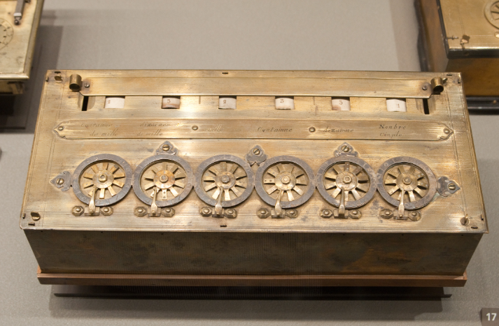

### Calculadora de Leibniz
**Gottfried Wilhelm von Leibniz (1646-1716)**, trinta anos após a [máquina de Pascal](#primeiro-computador-mecânico), construiu uma máquina mecânica capaz de fazer as **quatro operações básicas**.

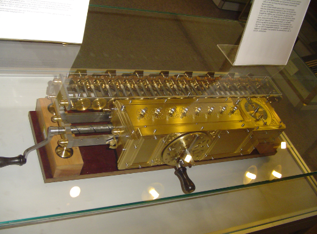

### Máquina de Babbage
- Após 150 anos dos primeiros computadores mecânicos, *Charles
Babbage*, projetou seu **motor diferencial**. Esse dispositivo
mecânico, como o de Pascal, só fazia **somas e subtrações**. 
    - A máquina foi projetada para rodar apenas um algoritmo já pré-definido.
- Não contente com isso, *Babbage* inventou o chamado **motor
analítico**, que possuía **4 componentes**: 
    - **Motor** : (processador)
    - **Armazém** (memória)
    - **Entrada** : (cartão perfurado)
    - **Saída** : (impressão).
- A máquina de Babbage era útil pois era de **propósito geral**, isto é, **não rodava apenas um algoritmo**. `Era programável!`
- Para produzir o *“software”*, *Babbage* contratou *Ada Lovelace*, filha do poeta *Lord Byron* : 
    - Pode-se considerar que o “primeiro programador” foi uma **mulher!**
    - `Linguagem ADA` em sua homenagem.
- Apesar de uma fantástica ideia, a máquina contava com
**problemas**, a tecnologia daquele século não colaborava com as ideias avançadas de *Babbage*.

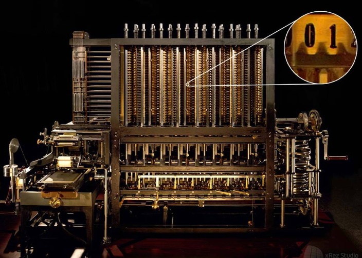

### Mark I
- *Howard Aiken*, ao terminar seu `Ph.D`. onde teve que fazer várias **contas numéricas** na mão, reconheceu a importância de uma máquina de calcular.
- Ao pesquisar sobre o trabalho de [*Babbage*](#máquina-de-babbage) e propôs **Mark I**, um computador operado por *relés* (dispositivo eletromecânico), **eixos
rotativos** e **engrenagens** (quase 5 toneladas).
- Quando o `Mark II` havia chegado, já estava ultrapassado. Os computadores eletrônicos já haviam chegado.

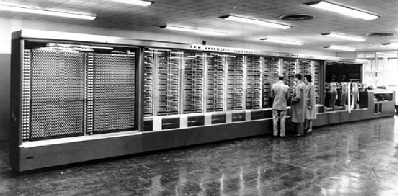

## Geração 1

### A Segunda Guerra Mundial
- O estímulo para a era **computacional eletrônica** foi a Segunda Guerra Mundial.
- Os Nazistas usavam um dispositivo chamado `ENIGMA` para
**codificar** e **decodificar** mensagens durante a guerra.
- A inteligência britânica, com a ajuda de *Alan Turing* construiu um **computador eletromecânico** denominado `COLOSSUS`.

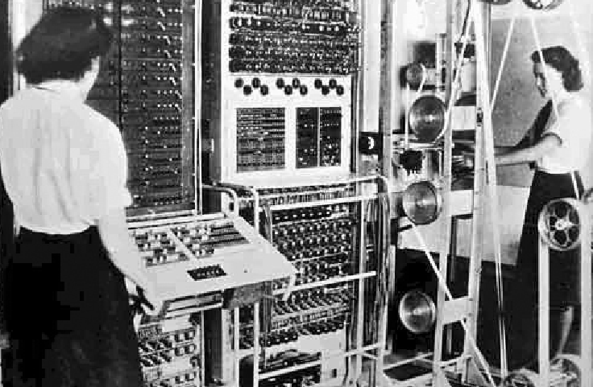

### ENIAC
- *Johh Mauchley*, estava atento que o **exército** estava interessado em computadores. Sabendo disso, ele propôs um **investimento ao exército** para construir um computador eletrônico.
- Assim surgiu o **ENIAC** (Eletronic Numerical Integrator and
Computer), que consistia de `18.000 válvulas` e `1500 relés`, pesava `30 toneladas` e consumia `140kW` de potência.

#### Um Pequeno Problema
- O `ENIAC` teve um **pequeno problema**, sua construção terminou em 1946, quando a **guerra já tinha acabado**. 
- *Mauchley* juntamente com *Eckert* organizaram uma escola de verão, para **descrever seu trabalho** a outros cientistas, o que deu **origem** a outros computadores:
    - `EDSAC`, `JOHNNIAC`, `ILLIAC`, `MANIAC`, `WEIZAC` ...
- Enquanto isso, *Mauchley* e *Eckert* trabalhavam no sucessor do `ENIAC`, o [`EDVAC`](#edsac).

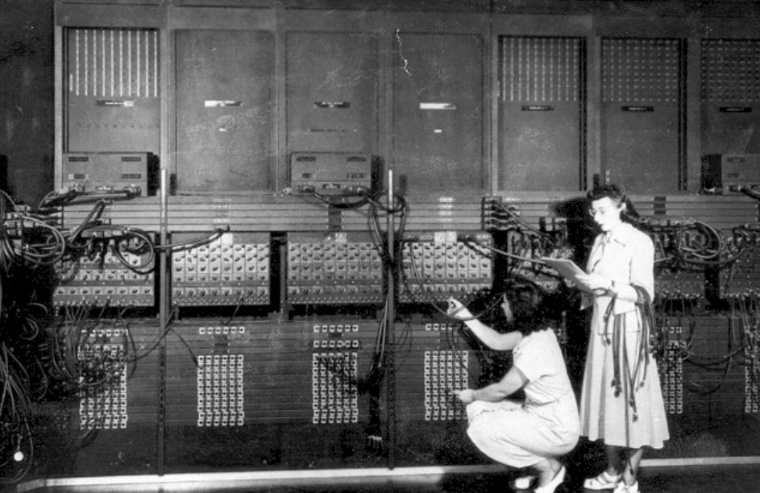

### EDSAC
- O `EDSAC` foi um dos projetos influenciados pelo [`ENIAC`](#eniac) e foi conduzido por *Maurice Wilkes*.
- Ele é considerado por muitos o **primeiro computador** a **armazenar** programas em** memória**, isto é, o primeiro computador de **propósito geral** que conseguira ser **implementado**.

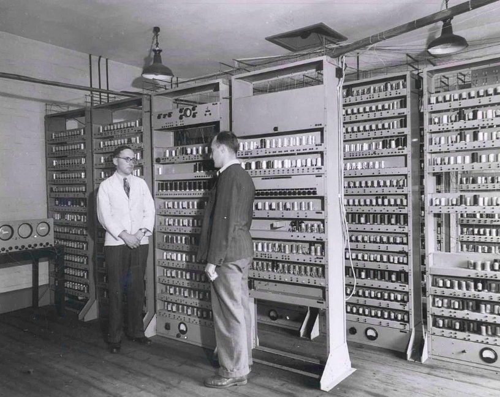

### IAS
- *John Von Neumann*, que era envolvido no projeto [`ENIAC`](#eniac), resolveu construir sua **própria versão** do [`EDVAC`](#edsac), a máquina `IAS`.
- Em essência, a máquina `IAS` tinha uma **organização específica**, que conhecemos hoje como `máquina de Von Neumann` ou `arquitetura de Von Neumann`.

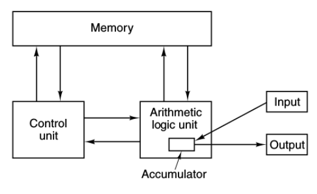

- A `máquina Von Neumann` de Possui 5 componentes:
    1. **Memória**.
    2. Unidade **lógica** e **aritmética**.
    3. Unidade de **controle**.
    4. Dispositivo de **Entrada**.
    5. Dipositivo de **Saída**.

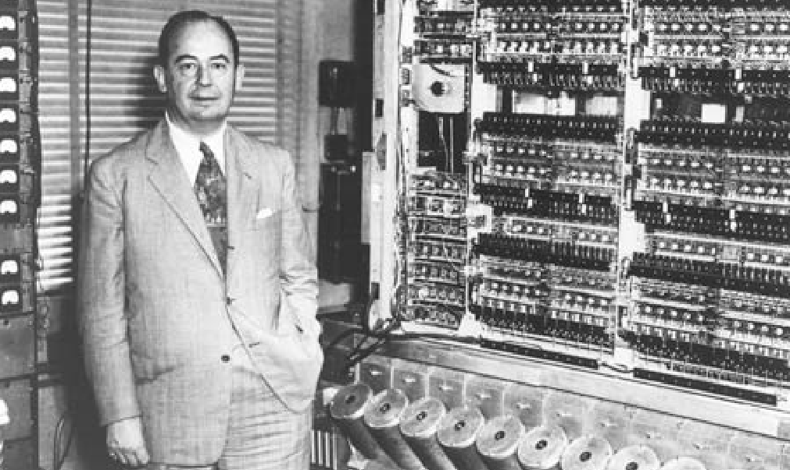

### IBM
- Enquanto tudo isso acontecia, a `IBM` era uma pequena empresa, não muito interessada em **computação**.
- Até que produziu o `IBM 701`, que foi a primeira de muitas **séries de computadores** que viria a dominar o mercado dentro de uma década.

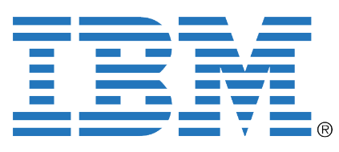

## Geração 2

### Transistores
- A segunda geração foi marcada pelos **transistores**, inventado em 1948 nos laboratórios ***Bell*** por *John Bardeen*, *Walter Bratain* e *William Shockley*, que ganharam o **prêmio Nobel** em 1956.
- Dentro de 10 anos da sua invençãoo, os **transistores** revolucionaram os computadores, tornando os **valvulados obsoletos**.

### TX-0 e TX-2
- O primeiro computador *“transistorizado”* foi o `TX-0`, e foi apenas um dispositivo criado para **testar** o `TX-2`.
- Por sua vez, o `TX-2` **não** se tornou um grande sucesso.

### PDP-1
- Em 1961. Surgia o `PDP-1` pela `DEC`. Seu **desempenho era metade** do `IBM 7090`, o computador mais **rápido** até o momento.
- O `PDP-1` custava `$120.000 dólares`, enquanto o `IBM 7090` custava milhões. A indústria dos **minicomputadores** nascia.
- Foram vendidas **50 unidades** do `PDP-1!`

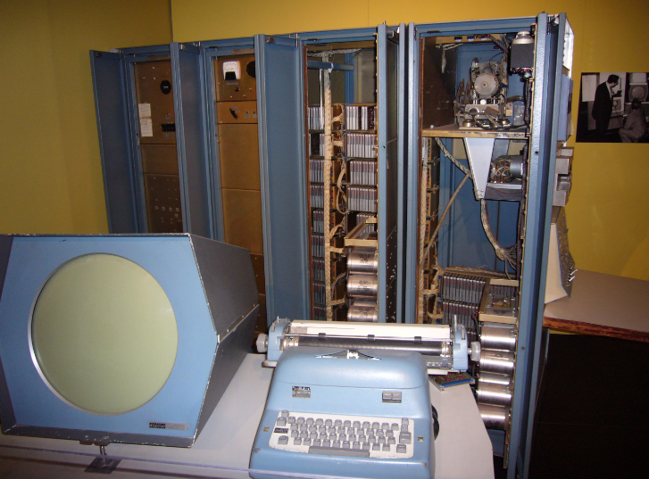

### PDP-8
- Depois de alguns anos, a `DEC` introduziu o `PDP-8`. O `PDP-8` era muito mais barato que o `PDP-1` ($16.000) e possuía uma inovaçãoo, o **omnibus**.
- Este **barramento universal** era uma `coleção de fios` que **interligava** os componentes do computador. Essa *arquitetura* foi inspirada na [máquina IAS](#ias) de *Von Neumann* e foi adotada por quase **todos os pequenos computadores** desde então.
- 50.000 unidades do `PDP-8` foram vendidas, estabelecendo a `DEC` como líder no mercado de **minicomputadores**

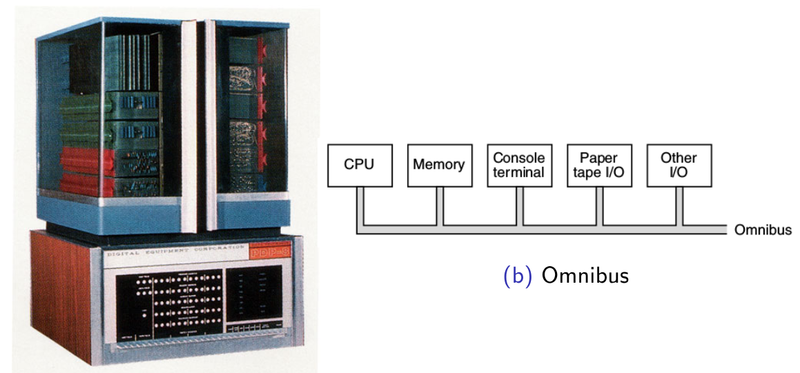

### IBM - 1401
- Enquanto a `IBM` dominava o mercado da `computação científica`, ela também fazia muito dinheiro vendendo **máquinas orientadas a negócio**. Sua principal arma era o `1401`.
- O `1401` podia **ler** e **escrever** em **fitas magnéticas**, **ler cartões perfurados** e imprimir t˜ao **rápido** quanto o `7090` e o sucessor `7094`, custando apenas uma **fração do preço** dos últimos.
- Era terrível para `computação científica`, mas ótimo para **organizar registros** de negócio.

### CDC-6600
- O computador `6600` foi projetado pela empresa **CDC**. Seu
projetista, *Seymor Cray*, também é considerado uma figura **lendária** na computação.
- O `6600` era quase `10×` mais **rápido** que o `7094`. Isso devido ao **paralelismo inerente** à máquina. Ela possuía diversas **unidades independentes** para fazer `adição, subtração, divisão,...` . 
- Com um esforço de programação, era possível conseguir executar **10 instruções** de uma só vez!

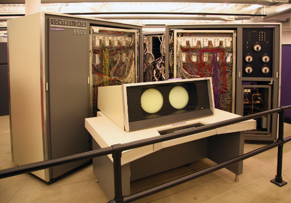

### Burroughs B500
- Os projetistas do `PDP-1`, `7094`, e `6600` estava todos preocupados com **hardware**, ou deixando o hardware **barato** (`DEC`) ou **rápido** (`IBM` ou `CDC`).
- Software era considerado **irrelevante**.
- Os projetistas do `B500` projetaram uma máquina otimizada para **executar** programas em `Algol 60`, uma linguagem precursora ao `C`, `Java` e outras.
- Infelizmente, **não** deu muito certo.

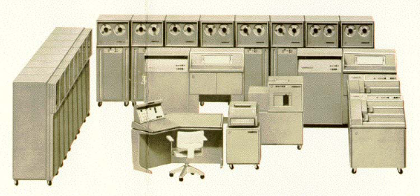

## Geração 3

### Circuitos Interligados

- Em 1958, *Jack Kilby* e *Robert Noyce* (**independentemente**),conseguiram colocar **dezenas de transistores** em um único **chip**.
- Isso possibilitou construir computadores cada vez **menores**, mais **rápidos** e mais **baratos**.

### IBM System/360
- Até o momento a [`IBM`](#ibm) estava ganhando muito dinheiro com o `7094` e o [`1401`](#ibm---1401). Mas eram **máquinas opostas**.
- Empresas não gostavam de ter que precisar de duas máquinas e dois departamentos de programação.
- A `IBM` então criou a **família** `System/360`, voltada tanto para **computação científica** quanto **comercial**.
- O detalhe mais importante é que todos os modelos possuíam a mesma linguagem `assembly`, o que possibilitava um programa rodar (na maioria das vezes) em **diferentes máquinas** `IBM`.

- Outra **inovação** do 360 era a chamada **multiprogramação**. Agora podíamos ter vários programas em **memória** ao mesmo tempo.
- Enquanto um estava esperando resultado de `entrada/saída` outro estava em execução.
- A **multiprogramação** é essencial para **maximizar** a utilização da `CPU`.

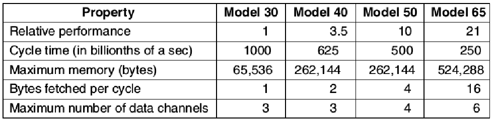

### DEC PDP-11
- Enquanto isso, no cenário de **minicomputadores**, a DEC lançava o `PDP-11`, **sucessor** do [PDP-8](#pdp-8).
- O `PDP-11` foi um sucesso, principalmente nas *universidades*, e graças à ele, a `DEC` continuava na liderança da indústria dos **minicomputadores**.

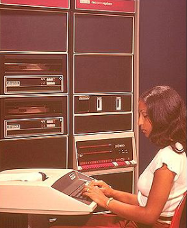

## Geração 4

### VLSI (Very Large Scale Integration)
- Em 1980, graças a `VLSI`, era possível por centenas, milhares e até **milhões de transistores** em um **único chip**.
- Isso possibilitou construir computadores cada vez mais **rápidos**, **baratos** e **menores**.
- Antes do [`PDP-1`](#pdp-1), computadores eram tão grandes que era preciso **departamentos** especiais chamados de **centros de processamento de dados**!

### Computadores Pessoais
- Na década de 80, computadores eram mais baratos, então surgiu a era dos **computadores pessoais**.
- Diferentemente de computadores enormes, computadores pessoais eram utilizados para **processamento de textos**, **planilhas**, **jogos**, coisas que os computadores maiores não lidavam muito bem.
- Os primeiros computadores pessoais eram vendidos como `kits` que incluíam principalmente um `Intel 8080`, **cabos**, **fonte** e talvez um **leitor de disquetes** de 8 polegadas.
- Montar as peças para formar um computador era **responsabilidade** do comprador. `Software` também **não era disponibilizado**.
- Um pouco depois, o sistema operacional `CP/M`, escrito por *Gary Kildall* se tornou bastante popular.
- Ele operava através do **disquete** e possuia **sistemas de arquivos** e suporte a **comandos escritos** do teclado através de um processador de comandos (`shell`).

### Apple
O `Apple` e o `Apple II`, projetados por *Steve Jobs* e *Steve Wozniak* em uma garagem, fizeram com que a `Apple` se tornasse um competidor sério.

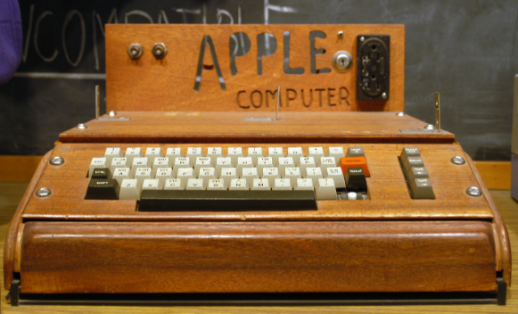
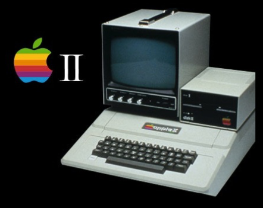
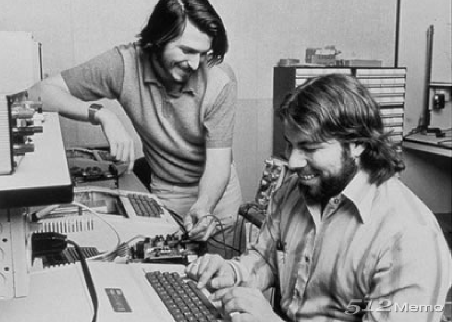

### IBM PC
- Ao observar o mercado de computadores pessoais, a `IBM` resolveu entrar no negócio.
- Em vez de fazer um computador pessoal com peças `IBM`, a
empresa preferiu construir um computador pessoal a partir de
**componentes comerciais** para fugir da **burocracia** da *própria empresa*!
- Surgia então o `IBM PC`, que possuía uma `CPU` `Intel 8088`.

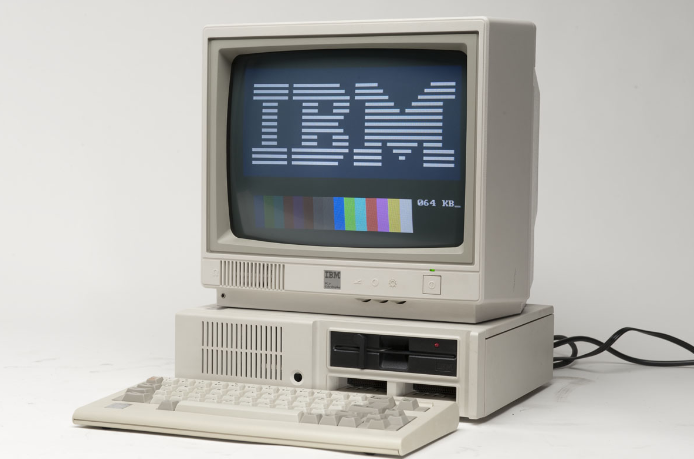

- O `IBM PC` foi um sucesso. Se tornou o computador pessoal **mais vendido da história**.
- A `IBM`, em vez de manter o projeto do `IBM PC` **oculto** (ou protegido por patentes), publicou os **detalhes** em um livro que custava *$49* para que outras companhias pudesses desenvolver **placas plug-in** para o `IBM PC`.
- Mas o tiro surgiu pela culatra. Agora várias companhias faziam **clones** do `IBM PC` e cobravam mais **barato** que a própria **IBM**.
- Uma indústria inteira começava.

### Apple Lisa e Macintosh
A [`Apple`](#apple), tentando responder a [`IBM`](#ibm-pc), lançou o `Apple Lisa`, o primeiro computador com **interface gráfica**.
- A ideia era **genial**, mas o preço, muito **alto**.
- Anos mais tarde, A Apple introduziu o `Macintosh`, um sucesso que faria a empresa ganhar muitos fãs.

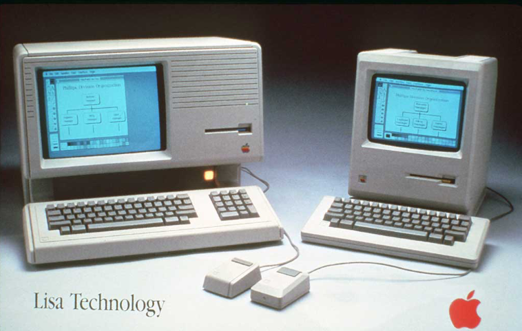

### Computador Port´atil
- Com a expensão dos [**computadores pessoais**](#computadores-pessoais), surgiu a id´eia de
**computadores portáteis**.
- `Osbourne-1` foi o primeiro. Pesava 11kg, teve certo sucesso e mostrou que era possível.

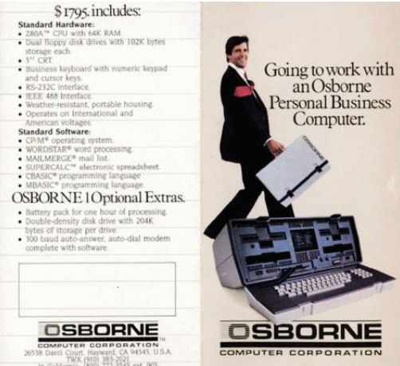

### Windows
- O [`IBM PC`](#ibm-pc) vinha equipado com o `MS-DOS`.
- Conforme os computadores iriam avançando, a `Microsoft`
desenvolveu o sucessor, `OS/2`, que constava com uma **interface gráfica**.
- Paralelamente, a `Microsoft` desenvolveu o `Windows`, que rodava em cima do `MS-DOS`.
- Resultado: `OS/2` não se **popularizou** e o `Windows` se tornou um sucesso.

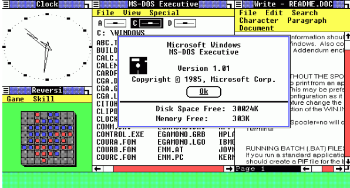
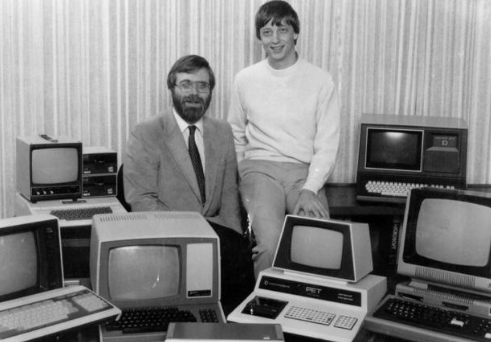

- **Família** `x86` da `INTEL`, `32-bits`.
    - `Pentium`
    - `Core`
    - ...
- Arquiteturas `RISC` em alta.
- `FPGA`, computadores **especializados**.
- `DEC Alpha 64`. Primeiro computador `64-bits RISC`. Grande
**desempenho** em relação aos outros PCs.
- Arquiteturas **paralelas** com `múltiplos cores`.
    - `IBM POWER 4` dual-core 2001.

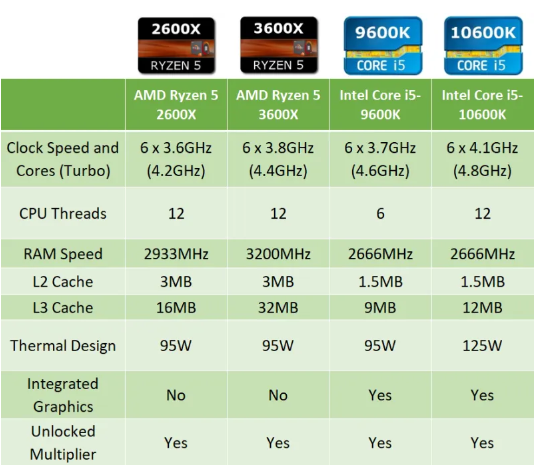

### Tendências
- Podemos esperar máquinas **mais baratas** com **mais cores** e **mais memória**.
- Dificuldade em **paralelizar** $\Rightarrow$ **desempenho** não era bem o que se esperava.
- **Múltiplos cores** $\Rightarrow$ desempenho **multiplicado**.
- **Processamento** em placas de vídeo (`GPGPU`):
    - CUDA.

## Geração 5

### Promessas
- Japoneses dominavam o mercado dos eletrônicos :
    - Câmeras.
    - Stereos.
    - Televisões.
- **Proposta**: Computadores inteligentes, baseados em `inteligência artificial`.
- `Geração 5` : computadores **diminuíram** e gastam **menos energia**:
    - Smartphones.
    - Tablets.
    - Computação Verde.
    - Computação Pervasiva.
    - ...

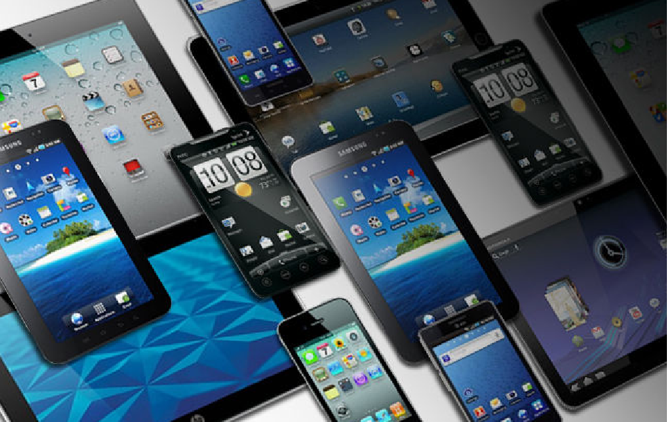

### Grid Systems
- Conceito de `PDA`: Personal Digital Assistant.
- 1989: `Gridpad`, Primeiro tablet.
- Vinha com uma caneta.
- Computação longe de uma mesa.
- Ancestral do smartphone e tablet.

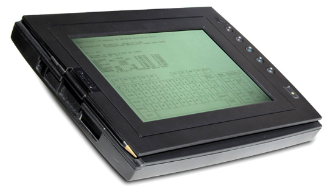

### Apple Newton
- 1993: Apple Newton.
- Miniaturização do PDA.
- Utilizava uma caneta

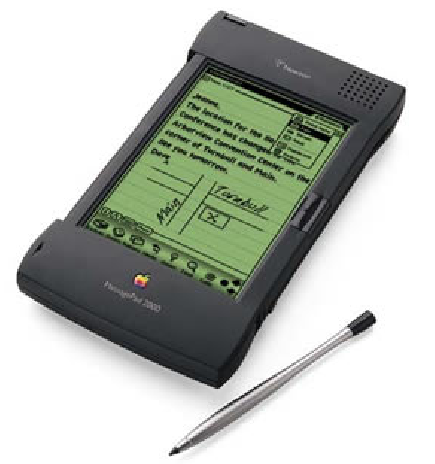

### IBM Simon
- Década de 90: **boom** de celulares.
- `IBM` pensou antes, integrou **telefone** com `PDA`.
- Surgiu o primeiro Smartphone: `Simon`
- Usava **touchscreen**.
- Suportava jogos, games, e-mail, agenda, . . .

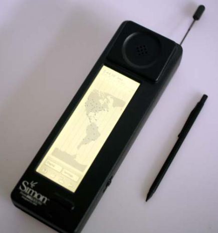

### Computadores Embarcados
- Hoje em dia, `computadores embarcados` estão presentes nos mais diversos equipamentos.
    - Cartões de banco.
    - Eletrodomésticos.
    - Carros.
    - Casa.
    - Urna eletrônica.
    - Roteadores.
    - MP3 players.
    - Relógios.
    - ...

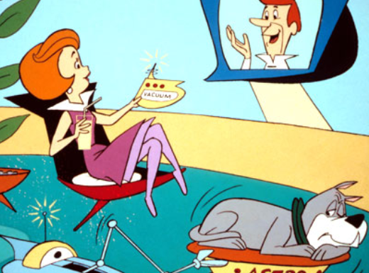
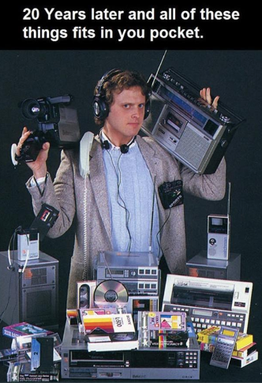

### Atualidade e Futuro
- Temos a chamada `computação ubíqua`.
- Computação faz parte do dia-a-dia em qualquer lugar.
- Tudo é controlado por computador:
    - Abertura de portas.
    - Controle de luzes.
    - ...

