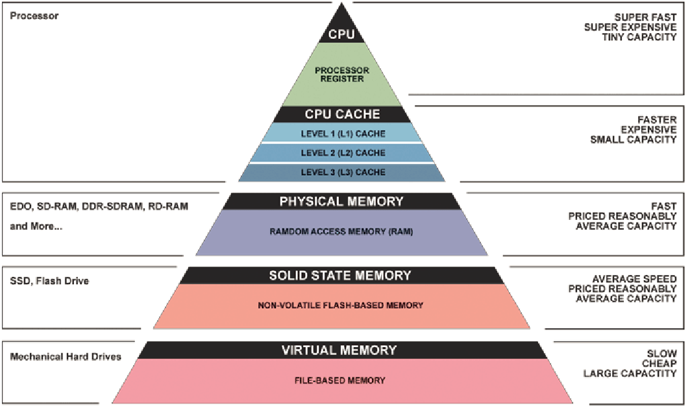
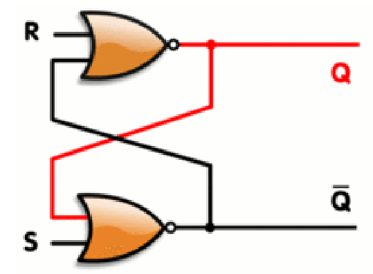
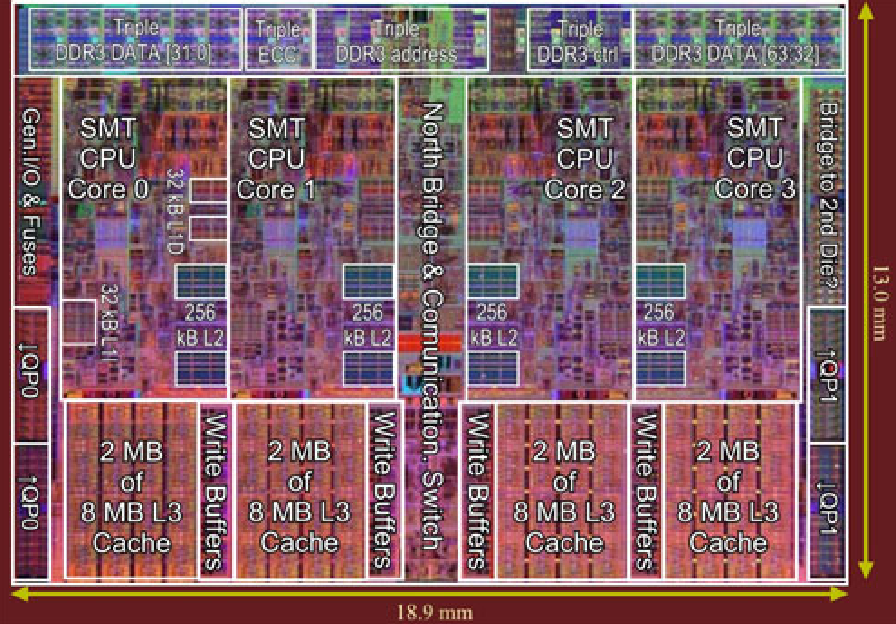
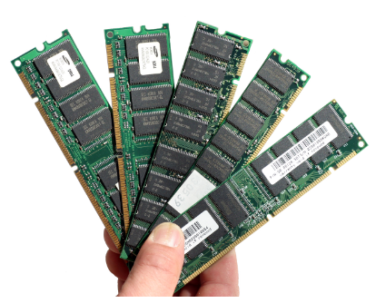
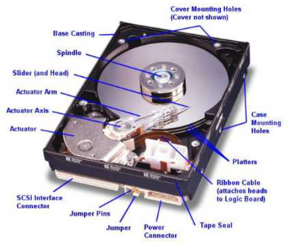
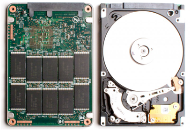
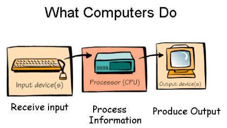
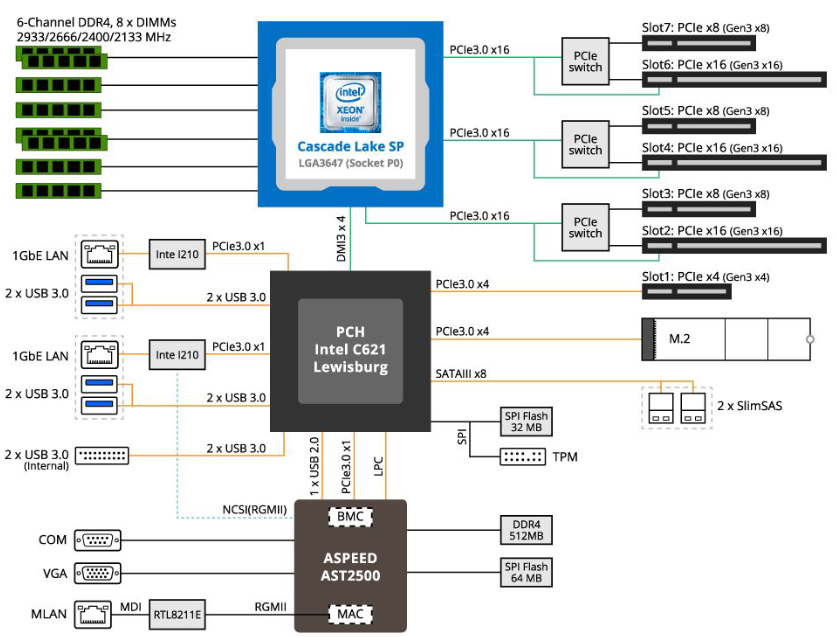

# Conceitos Preliminares

## Tradutores

### Humano vs Máquina
- Existe uma certa diferença nos **níveis de abstração** entre homem e máquina.

| Computador | Humano | 
| :--------: | :----: |
| *“mastiga bits”*. | **abstração** mais alta      |
| linguagem de máquina | linguagens de programação | 

- Precisamos de uma `ferramenta` que faça a **conversão** de uma linguagem que está em um nível de abstração mais **alto** (próximo à `linguagem natural`) a um nível de abstração mais **baixo** (`linguagem de máquina`).
- **TRADUTORES!!** 

### Linguagem de Programação
- Uma` linguagem de programação` é um **conjunto de regras**, `sintáticas` e `semânticas`, que possibilitam a escrita de programas.
- Próxima à uma `linguagem natural` (Português, Inglês).
- Os programas por sua vez, podem ser `compilados` ou `interpretados` para **executar** no computador.
- Exemplos de linguagem de programação: `C`, `Pascal`, `C++`, `Java`, `Python`, `Assembly X86`, `Ruby`, `Perl`, ...
- Mesmo entre linguagens de programação, podemos dizer que
algumas possuem um **nível de abstração maior** do que outras (e.g. `C` vs `Assembly X86`).

### Código-fonte
- Essencialmente programar consiste em **implementar** um **algoritmo** em uma linguagem de programação.
- Essas instruções devem ser escritas em um **arquivo**, chamado de `código-fonte`, através de um `editor de textos`.
- Cada código fonte normalmente possui uma extensão associada à linguagem:
    - `C` : `.c` e `.h`
    - `C++` : `.cpp` e `.hpp`
    - `Java` : `.java`
    - `Python` : `.py`
    - ...

$\text{Algoritmo}_1$ : Programa simples em `C`

```c
#include <stdio.h>

int main(void){
    printf("Hello World!\n");
    return 0;
}
```

$\text{Algoritmo}_2$ : Programa simples em `Java`

```java
class Main {
    public static void main(String args[]){
        System.out.println("Hello World");
    }
}
```

$\text{Algoritmo}_3$ : Programa simples em `Python`

```python
print('Hello World')
```

### Compiladores
- Os `compiladores` **convertem** um conjunto de instruções escritos em uma linguagem com um **maior nível** de abstração em uma linguagem com **menor nível** de abstração.
- Assim, um `compilador` pode, por exemplo, converter um programa escrito em uma **linguagem de programação** em um programa em **linguagem de máquina**, para que possa ser **executado** diretamente no computador.
- Exemplo de `linguagens compiladas`: `C`, `C++`, `Rust`, ...

### Interpretador
- Um `interpretador` por sua vez consiste em interpretar, **sob demanda**, instruções que estejam escritas em um nível de abstração mais alto em instruções em um nível de abstração mais baixo.
- Diferente da `compilação`, que **converte todas as instruções** de uma **única vez** para um nível de abstração mais baixo.
- Exemplo de linguagens interpretadas: `Python`, `Perl`, `Javascript`, ...

### Linguagens Compiladas vs Interpretadas
- Normalmente `linguagens compiladas` tendem a possuir **mais desempenho** que `linguagens interpretadas`.
- Linguagens `interpretadas` tendem a ser mais **flexíveis**, possibilitando por exemplo a **execução** de códigos **auto-modificáveis** de uma maneira mais fácil
- Na prática as coisas **não** são tão **binárias**.
- Just in time compilation (`JIT`) : Consiste na **compilação de partes** de um programa durante a sua **execução** para **melhor desempenho**.Técnica muito utilizada em `linguagens interpretadas`.
- `Bytecode` : Algumas linguagens tendem a compilar o programa para uma linguagem de **nível de abstração intermediário** para que ela possa ser executada por uma `Máquina Virtual` (e.g. `Java`).

## Hardware
- A grosso modo, podemos ver um computador digital moderno sendo composto de:
    - [`Processador`](#processador)
    - [`Memória`](#memória)
    - [`Dispositivos de E/S`](#dispositivos-de-es)
    - [`Barramento`](#barramento)

### Processador
- **Cérebro** do computador.
- Responsável por `buscar`, `decodificar` e `executar` instruções.
- Possui dois componentes:
    - Unidade lógica e aritmética (`ULA`) 
    - Unidade de controle (`UC`)
- `ULA` : Responsável por efetuar operações **lógicas** e **aritméticas**.
- `UC` : Controla **todas as ações** a serem realizadas pelo computador.
- Atualmente: `arquiteturas multicore`.
- Um computador possui **vários processadores**.
- Cada processador pode ter **vários núcleos de processamento**.

### Memória
- Para produzir um resultado final de uma computação, muitas das vezes precisamos `armazenar` os **resultados temporários**
    - Utiliza-se a memória
- Dispositivos mais rústicos de computação já possuíam uma **espécie de memória**

### Hierarquia de Memória
- **Idealmente** a memória deveria ser tão **rápida** quanto o [`processador`](#processador), para não gerar nenhum **gargalo**.
- Isso **não** é possível: **memórias rápidas** são muito **caras**.
- Utilizamos **diferentes tipos** de memória em um computador, com `capacidades` e `tempo de acessos` **diferentes**.
- `Hierarquia de memória` : Dispõe as memórias em um nível hierárquico de acordo com a sua `capacidade` e `tempo de acesso`.



- Memórias `mais rápidas` e com `menos capacidade` estão no **topo da pirâmide**.
- Memórias `mais lentas`, `baratas` e com `mais capacidade` estão na **base da hierarquia**.

#### Registradores
- Memória `mais rápida` e `menor`.
- Poucos `bytes`.
- Opera na *“velocidade”* da `CPU`.
- Usada para `armazenar` resultados **intermediários de cálculos** da `ULA`.
- Elemento eletrônico: `flip-flop`.



#### Memória Cache
- Ficam próximas ao `núcleo de processamento`.
- Utilizadas para **minimizar** o acesso à memória `RAM`.
- Armazenam **dados** com **maior probabilidade** de serem utilizados.
- Subdivididas em três níveis: `L1`, `L2` e `L3`.
    - `L1` : `poucos KB`, mais rápida.
    - `L2` : `alguns KB`, intermediária.
    - `L3` : `poucos MB`, mais lenta.



#### Memória RAM
- Memória mais **lenta** que a [`cache`](#memória-cache).
- Alguns `GB`.
- Usada para armazenar **dados maiores** que não caibam em `cache`.
- Mais **distante** da `CPU`.



#### Memória Primária
- As memórias apresentadas estão dentro da categoria de `memória primária`, pois são **acessadas diretamente** pela `CPU`.
- São memória consideradas **rápidas**, mas possuem um problema,são `voláteis`.
- Necessitam de **constante alimentação de energia** para armazenarem informação.
- Para conservar os dados mesmo **sem alimentação de energia** de uma maneira `persistente`, precisamos de outros tipos de memória: [`memória secundária`](#memória-secundária).

#### Memória Secundária
- Mais **lentas** que as [`memória primárias`](#memória-primária).
- **Não** acessíveis **diretamente** pela `CPU`, necessitam de **comunicação** para que os dados sejam transferidos para [`memória primária`](#memória-primária).
- Armazenamento tipicamente **persistente**: Os dados **persistem na memória** mesmo quando o computador **não** está funcionando.
- Exemplos: [`HDDs`](#unidade-de-disco-rıgido), [`SSDs`](#unidade-de-estado-sólido-sdd), [`Fitas Magnéticas`](), ...

#### Unidade de Disco Rígido (HDD)
- Composto por várias `superfícies magnéticas`.
- Possui cerca de `100×` mais **capacidade** que a `RAM`.
- Cerca de `1000000×` mais **lenta** que a `RAM`.
- Dispositivo **mecânico**: braços e cabeças de leitura.
- Dispositivo **eletrônico**: controladora



#### Unidade de Estado Sólido (SDD)
- Dispositivo **inteiramente eletrônico**.
- Mais **rápido** que o [`HD`](#unidade-de-disco-rígido-hdd) (até $10^2$ vezes para acesso aleatório).
- Normalmente **menos capacidade** que um [`HD`](#unidade-de-disco-rígido-hdd) pelo **mesmo custo**.
Tendência: popularização.



#### Fitas Magnéticas
- Muito barata.
- Leitura `sequencial` **rápida**,leitura `aleatória` **ruim**.
- Dura anos se armazenada corretamente.
- Principal uso: `backup`.


### Dispositivos de E/S
- Dispositivos de E/S são empregados para **fornecer** uma `entrada` (ou `saída`).
- **Exemplos :** Impressoras,teclado, mouse, monitor, câmera digital, modem, caixas de som, ...
- Divididos em: `controladora` e `dispositivo`.
- `Controladora` : faz a **interface** com os demais componentes. 



### Barramento
- Responsáveis por **transferir dados** e **comandos** de um dispositivo à outro.
- Temos vários barramentos especializados com diferentes taxas de transferência.



