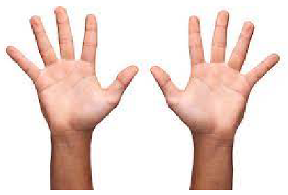

# Representação Numérica

## Introdução
- Utilizamos números para expressar quantidades.
- Um `sistema de numeração` consiste nos **símbolos** utilizados para **representar os números**.
- O mais utilizado no dia a dia é o `sistema decimal` de numeração, apesar de várias civilizaçõees terem adotado outros sistemas no passado.

### Sistema Decimal
- Temos **10 algarismos**: {0, 1, 2, 3, 4, 5, 6, 7, 8, 9}.
- Possui `base 10`.
- É um **sistema posicional**, em que a posição dos
algarismos indica o **peso** a ser aplicado àquele algarismo.
- Os algarismos são colocados em **sequência** para compor um
número.
- *Exemplo:* $9543 = 3 \cdot 10^0 + 4 \cdot 10^1 + 5 \cdot 10^2 + 9 \cdot 10^3 = 3 + 40 + 500 + 9000.$
-  Um número $x$, de $n$ dígitos,composto da sequência de dígitos $x_{n-1} x_{n−2} \ldots x_0$ pode ser interpretado da seguinte maneira :

$$ x = \sum_{i = 0}^{n - 1} x_i \cdot 10^i $$

### Sistema Binário
- É muito relevante para a Computação, uma vez que a `lógica digital` é `booleana`.
- Este sistema possui apenas **dois algarismos** (`bits`): 0 ou 1, 
    - Ligado ou desligado; 
    - Com tensão ou sem tensão; 
    - ...
- É um **sistema posicional**.
- Possui `base 2`.

> Notação: Seja $x$ um número e $d$ uma baseDiremos que x está escrito de acordo com o sistema de base d com a seguinte notação: 
> $$x_d$$

- *Exemplos:* $1001001_2, 1101_2, 11001100_2.$

#### Conversão Binário-Decimal
- Um número **binário** $x = x_{n-1} x_{n−2} \ldots x_0$ pode ser convertido para o seu equivalente em **decimal** realizando a seguinte soma:

$$ \sum_{i = 0}^{n - 1} x_i \cdot 2^i $$

- *Exemplos:*
- $10_2 = 0 \cdot 2^0 + 1 \cdot 2^1 = 2_{10}$
- $1101_2 = 1 \cdot 2^0 + 0 \cdot 2^1 + 1 \cdot 2^2 + 1 \cdot 2^3 = 13_{10}.$
- $111_2 = 1 \cdot 2^0 + 1 \cdot 2^1 + 1 \cdot 2^2 = 7_{10}.$ 

#### Conversão Decimal-Binário
- Também é possível realizar o processo inverso: Converter um
número decimal em seu equivalente em binário.
- Utilza-se o **processo inverso**: em vez de `multiplicações`, usamos `divisões`.
- **Algoritmo:** Dividir o número por 2 e **guardar** o `resto da divisão` a cada etapa. 
- Quando o quociente chegar a 0, compor o número binário utilizando o resultado dos restos de **trás para frente**.

- *Exemplo:*
    | **Número** | **Quociente** | **Resto** |
    | :--------: | :-----------: | :-------: |
    |     225    |      112      |     1     |
    |     112    |       56      |     0     |         
    |     56     |       28      |     0     |         
    |     28     |       14      |     0     |         
    |     14     |       7       |     0     |       
    |     7      |       3       |     1     |         
    |     3      |       1       |     1     |
    |     1      |       0       |     1     |

    - $225_{10} = 11100001_2.$

### Sistema Octal
- Baseado nos algarismos {0, 1, 2, 3, 4, 5, 6, 7}.
- Possui `base 8`
- Um **número binário** pode ser convertido *facilmente* para um **número octal** ao separá-lo em `triplas` (da esquerda para a direita) e **interpretar** os valores destas triplas.
- Caso o número de `bits` **não** seja `múltiplo de 3`, o **último agrupamento** de bits (mais à esquerda) terá 1 ou 2 bits.

#### Conversão Binário-Octal
- *Exemplos:*
    - $\underbrace{101}_{5}\ \underbrace{011}_{3} = 53_8$
    - $\underbrace{11}_{3}\ \underbrace{010}_{2} = 32_8.$
    - $\underbrace{1}_{1}\ \underbrace{110}_{6} = 16_8.$

#### Conversão Octal-Binário
- Para converter um número octal para um número em binário
fazemos o **processo inverso**.
- Cada algarismo em octal representará `três` em `binário`.

    | **Octal** | **Binário** |
    | :-------: | :---------: |
    |     0     |     000     |
    |     1     |     001     |
    |     2     |     010     |
    |     3     |     011     |
    |     4     |     100     |
    |     5     |     101     |
    |     6     |     110     |
    |     7     |     111     |

- *Exemplos:*
    - $42_8 = 100010_2$
    - $71_8 = 111001_2$
    - $15_8 = 001101_2 = 1101_2$ (zeros à esquerda são omitidos).

#### Conversão Octal para Decimal
- Para converter um número **octal** $x = x_{n-1} x_{n−2} \ldots x_0$ para **decimal**, basta aplicar o somatório:

$$ \sum_{i = 0}^{n - 1} x_i \cdot 8^i $$

- *Exemplo:* $7234_8 = 4 \cdot 8^0 + 3 \cdot 8^1 + 2 \cdot 8^2 + 7 \cdot 8^3 = 3740_{10}$

#### Conversão Decimal para Octal
- **Algoritmo:** Dividir o número por 8 e **guardar** o `resto da divisão` a cada etapa. Quando o **quocientePP** chegar a 0, compor o número octal utilizando o resultado dos `restos` de trás para frente.

- *Exemplo:*

    | **Número** | **Quociente** | **Resto** |
    | :--------: | :-----------: | :-------: |
    |    3740    |      467      |     4     |
    |     467    |       58      |     3     |         
    |     58     |       7       |     2     |         
    |      7     |       0       |     7     |

    - $3740_{10} = 7234_8$

### Sistema Hexadecimal
- É composto pelos algarismos {0, 1, 2, 3, 4, 5, 6, 7, 8, 9, A, B, C, D, E, F}.
- Permite **compactar** ainda mais um **número binário**, enquanto mantém sua `conversão simples`.

#### Conversão Binário-Hexadecimal
- Para converter um número binário em hexadecimal, seguimos uma estratégia **muito parecida** com a conversão de binário para octal.
- Em vez de `triplas`, utilizamos `quádruplas`!
- Caso o número de bits **não** seja `divisível por 4`, a `quádrupla` mais à esquerda terá de 1 a 3 bits.
- *Exemplos:*
    - $\underbrace{1010}_{A}\ \underbrace{0101_2}_{5} = A5_{16}$
    - $\underbrace{110}_{6}\ \underbrace{1111_2}_{F} = 6F_{16}.$
    - $\underbrace{10}_{2}\ \underbrace{0111_2}_{7} = 27_{16}.$
    - $\underbrace{1}_{1}\ \underbrace{0111_2}_{3} = 13_{16}.$

#### Conversão Hexadecimal-Binário
- A conversão de hexadecimal para binário é bem **simples**, cada número hexadecimal produz `4 bits`. Utilizamos a seguinte tabela:

    | **Hexadecimal** | **Binário** |
    | :-------------: | :---------: |
    |        0        |     000     |
    |        1        |     001     |
    |        2        |     010     |
    |        3        |     011     |
    |        4        |     100     |
    |        5        |     101     |
    |        6        |     110     |
    |        7        |     111     |
    |        8        |    1000     |
    |        9        |    1001     |
    |        A        |    1010     |
    |        B        |    1011     |
    |        C        |    1100     |
    |        D        |    1101     |
    |        E        |    1110     |
    |        F        |    1111     |

- *Exemplos:*
    - $FC_{16} = 11111100_2$
    - $79_{16} = 01111001_2 = 1111001_2$
    - $2D_{16} = 00101101_2 = 101101_2$
    - $1B_{16} = 00011011_2 = 11011_2$

#### Conversão Hexadecimal para Decimal
- Para converter um número **hexadecimal** $x = x_{n-1} x_{n−2} \ldots x_0$ para **decimal**, basta aplicar o somatório:

$$ \sum_{i = 0}^{n - 1} x_i \cdot 16^i $$

- *Exemplo:* $F53A_{16} = 10 \cdot 16^0 + 3 \cdot 16^1 + 5 \cdot 16^2 + 15 \cdot 16^3 = 62778_{10}$

#### Conversão Decimal para Hexadecimal
- **Algoritmo:** Dividir o número por 16 e **guardar** o `resto da divisão` a cada etapa. Quando o **quociente** chegar a 0, compor o número hexadecimal utilizando o resultado dos `restos` de trás para frente.

- *Exemplo:*

    | **Número** | **Quociente** | **Resto** |
    | :--------: | :-----------: | :-------: |
    |   62778    |     3923      |    10 (A) |
    |    3923    |      245      |     3     |         
    |    245     |      15       |     5     |         
    |     15     |       0       |    15 (F) |

    - $62778_{10} = F53A_{16}.$

## Inteiros 
- Mas como representamos n´umeros negativos?
- Como representar os n´umeros inteiros computacionalmente?

### Sinal-magnitude
- Na abordagem de sinal magnitude, reservamos o `bit mais significativo` (mais à esquerda) para descrever o sinal:
    -  0: indica que o número é **positivo**.
    -  1: indica que o número é **negativo**.
- Os **demais bits** descrevem o número da forma como vimos
anteriormente.
- Se $x = x_{n-1} x_{n−2} \ldots x_0$ é um número em
binário no formato `sinal-magnitude`, podemos obter o decimal
correspondente da seguinte maneira:

$$ -1^{x_{n-1}} \cdot \sum_{i = 0}^{n - 2} x_i \cdot 2^i $$

- *Exemplos:*
    - $0100101_2 = −1^0 \cdot (1 \cdot 2^0 + 0 \cdot 2^1 + 1 \cdot 2^2 + 0 \cdot 2^3 + 0 \cdot 2^4 + 1 \cdot 2^5) = 37_{10}$
    - $111001_2 = −1^1 \cdot (1 \cdot 2^0 + 0 \cdot 2^1 + 0 \cdot 2^2 + 1 \cdot 2^3 + 1 \cdot 2^4) = −25_{10}$

#### Vantagens/Desvantagens
Assumindo que estamos utilizando `n bits` para representar números binários

- Vantagens:
    - Representação familiar.
- Desvantagens:
    - O valor $0_{10}$ possui **duas representações** em binário: $1\underbrace{00 \ldots 0}_{n-1}$ e $0 \underbrace{0 \ldots 0}_{n-1}$.
    - Aritmética mais complicada, sempre temos que examinar o `bit de sinal`.
- Intervalo representado é **simétrico** $[−(2^{n−1} − 1), 2^{n−1} − 1]$.

### Complemento de Um
- A abordagem complemento de um representa os **números negativos** simplesmente `invertendo os bits` do número
correspondente **positivo**.
- O `bit mais significativo` é utilizado para indicar o **sinal**, como na abordagem sinal-magnitude. 
- *Exemplos:* Considerando que estamos representando os números binários com 8 bits
    - $43_{10} = 00101011_2$.
    - $-43_{10} = 11010100_2$.

#### Vantagens/Desvantagens
Assumindo que estamos utilizando `n bits` para representar números binários

- Vantagens:
    - Arirmética mais direta.
- Desvantagens:
    - O valor $0_{10}$ possui **duas representações** em binário: $1\underbrace{00 \ldots 0}_{n-1}$ e $0 \underbrace{0 \ldots 0}_{n-1}$.
- Intervalo representado é **simétrico** $[−(2^{n−1} − 1), 2^{n−1} − 1]$. 

### Complemento de Dois

## Reais

## ASCII

