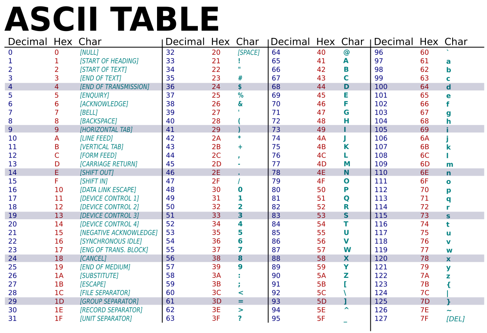

# Variáveis, Atribuição e Tipos Primitivos

## Variáveis
- Uma **variável** é um nome para uma `posição de memória` que **armazena** um valor.
- Através dos nomes das variáveis, podemos realizar `operações` entre valores.
- Cada variável tem um **tipo**, que determina que `tipo de informação` está armazenada naquele pedaço de memória indicado pelo **nome da variável**.
- O ato de **declarar** uma variável consiste em dizer qual o `tipo` e o `nome` referentes a ela.

### Declaração de uma Variável
`<tipo> nome_da_variável;`

### Regras para Nomeação de Variáveis
- Existem algumas regras para nomeação das variáveis.
- Caso uma variável seja nomeada com um nome que **não atenda** essas regras, o programa **não** poderá ser **compilado**.
- Devemos obedecer a **sintaxe** correta da linguagem.

#### Regras
1. Deve começar com uma **letra** ou **subscrito** (_).
2. Pode ser composta de **letras maiúsculas** e **minúsculas** (*sem acento*), **números** e **subscrito**.
3. Não se pode utilizar **caracteres especiais** como: {( + - * / \ ; . , ? )}
4. Não se pode utilizar um nome **já declarado antes**. Exceto se em `escopos diferentes`.
5. Não se pode utilizar palavras **reservadas** da linguagem C.

*Exemplos:*
```c
/* Uso Incorreto */
int 42b; // não começa com letra ou subscrito
float @variavel; // contém caractere especial
char isso#naopode; // contém caractere especial
int a; // ok
float a; // não está ok, já existe uma variável chamada 'a'
int b; // ok
int b; // não está ok, já existe uma variável chamada b

/* Declaração de Variáveis */
int numero;
float euler;
double numero_real;
char letra;
```

> [!NOTE]
>
> #### Boa Prática de Programação: Nomeação de Variáveis
> Sempre utilize nomes **mnemônicos** para suas variáveis. Isso deixará o
> seu programa mais **legı́vel** por você e por outras pessoas. Evite utilizar
> nomes que não reflitam o uso daquela variável.

```c
// Variáveis Mnemônicas
double preco_abacate;
int idade_usuario;
char opcao_escolhida;

// Variáveis não Mnemônicas
double fnx;
int seila;
char nanananabatman;
```

#### Palavras Reservadas
- Existem diversas palavras reservadas em C que não podem ser empregadas no nome de variáveis.

|   |  |  |  |
| -------- | -------- | ---------- | -------- |
| auto     | else     | long       | switch   |
| break    | enum     | register   | typedef  |
| case     | extern   | return     | union    |
| char     | float    | short      | unsigned |
| const    | for      | signed     | void     |
| continue | goto     | sizeof     | volatile |
| default  | if       | static     | while    |
| do       | int      | struct     | double   |

> [!NOTE] 
>
> As palavras  `_Bool`, `_Complex`, `_Imaginary`, `inline` e `restrict` foram introduzidas no padrão **C99**.

### Case Sensitivy
- A nomeação de variáveis e outros identificadores na linguagem C é sensı́vel ao caso (`case-sensitive`), isto é, se tivermos mesma sequência de sı́mbolos, mas com **diferentes capitalizações**, tratamos como variáveis (ou identificadores) **distintos**.
- *Exemplos:*
    - a $\neq$ A
    - numero $\neq$ Numero

```c
int a; // ok
int A; // ok
float numero_real; // ok
double Numero_real; //ok
```

### Múltiplas Declarações
- Caso queiramos declarar diversas variáveis de um mesmo tipo, podemos fazê-lo em uma **única linha**.
- Basta **separar** as variáveis por **vı́rgulas**.
- Sintaxe: `<tipo> <nome_1>, <nome_2>, ... , <nome_n>;`

*Exemplo:* Múltiplas Declarações
```c
int num_1,num_2,num_3;
```

## Tipos
- O tipo de uma variável determina **o que** pode ser **armazenado** por ela.
- Em C, de maneira primitiva, podemos armazenar números `inteiros`, números `reais` (**ponto flutuante**) e `caracteres`.
- O `número de bits`, e consequentemente a **quantidade de valores** que é possı́vel armazenar em uma variável de um dado tipo, é dependente da `arquitetura` de computador utilizada, contudo, a linguagem C estipula o **número mı́nimo de bits** que deve ser suportado por qualquer compilador nas diferentes arquiteturas.
- Alguns tipos podem ser precedidos de **modificadores** como `unsigned`, `short` ou `long`, que indicam se o número tem **sinal** ou não e o **tamanho** do número. Isso interfere diretamente no intervalo de valores representáveis pela variável.

### Inteiros
- Tipo: `int`.
- Normalmente as arquiteturas modernas utilizam **representação binária** em `complemento de dois` para números **inteiros com sinal**.
- Admitem os modificadores `short`, `long` e `unsigned`.

| **Tipo**               | Tamanho Mínimo | Tamanho Típico | **Intervalo de Representação** (Típico)                    |
| ---------------------- | -------------- | -------------- | ------------------------------------------------------ |
| short                  | 2 bytes        | 2 bytes        | −32.768 a 32.767                                       |
| unsigned short         | 2 bytes        | 2 bytes        | 0 a 65.535                                             |
| int                    | 2 bytes        | 4 bytes        | −2.147.483.648 a 2.147.483.647                         |
| unsigned int           | 2 bytes        | 4 bytes        | 0 a 4.294.967.295                                      |
| long int               | 4 bytes        | 8 bytes        | −9.223.372.036.854.775.808 a 9.223.372.036.854.775.807 |
| unsigned long int      | 4 bytes        | 8 bytes        | 0 a 18.446.744.073.709.551.615                         |
| long long int          | 8 bytes        | 8 bytes        | −9.223.372.036.854.775.808 a 9.223.372.036.854.775.807 |
| unsigned long long int | 8 bytes        | 8 bytes        | 0 a 18.446.744.073.709.551.615                         |

### Reais
- Tipo: `float` ou `double`.
- Normalmente as **arquiteturas modernas** utilizam o padrão `IEEE 754` para representação de números reais através de **ponto flutuante**.
- O tipo `double` admite o **modificador** `long`.

#### float
- `32-bits`;
- A grosso modo, possui uma precisão de **6 casas decimais**.
- Intervalo de representação está contido em : $[10^{−38} , 10^{38}]$.

#### double
- `64-bits`;
- A grosso modo, possui uma precisão de **15 casas decimais**.
- Intervalo de representação está contido em : $[10^{−308} , 10^{308}]$.

#### long double
- `80-bits` (tipicamente), `96-bits` ou `128-bits`;
- Intervalo de representação está contido em : $[10^{−4951}, 10^{4932}]$.

### Caracteres
- Caracteres em C são representados internamente da mesma forma que inteiros, mas utilizando apenas `1 byte` (`8 bits`).
- Um valor de um caractere é um **inteiro** que corresponde ao **ı́ndice** de uma letra na tabela `ASCII`.
- Apenas um caractere pode ser armazenado em uma variável do tipo `char`.
- O tipo `char` admite o **modificador** `unsigned`.
- Para representar uma **sequência de caracteres** (uma palavra), temos que utilizar uma `string`.



| **Tipo**      | Tamanho | **Intervalo de Representação** |
| ------------- | ------- | -------------------------- |
| char          | 1 byte  | −128 a 127                 |
| unsigned char | 1 byte  | 0 a 255                    |

## Atribuição
- Utilizamos o comando de `atribuição (=)` para **designar** valores as nossas variáveis.
- O comando de atribuição designa um valor para uma variável **previamente** declarada.
- Para isto, utilizamos da seguinte sintaxe: `<variavel> = <expressão>`

> [!IMPORTANT]
>
> Sempre declarar **todas** as variáveis **antes** de sua atribuição.


*Exemplos*:
```c
double pi;
pi = 3.1415;
char c;
c = 65; /* C recebe o valor 65, que corresponde ao caractere 'A'.*/
```

> [!NOTE]
>
> A separação entre a parte inteira e a parte fracionária é feita através do sı́mbolo de `'.'` .

### Atribuição e Caracteres
- Apesar de os caracteres se comportarem como **inteiros** de `1 byte` na linguagem C, podemos usar o operador de atribuição indicando o valor do caractere entre **aspas simples**, sem a necessidade de consultar a `tabela ASCII`.
- Isto deixa o programa mais legı́vel e menos propenso a erros.

```c
char c;
c = 'A'; // C recebe o valor 'A', que internamente é 65.
```

### Declaração e Atribuição
- É possı́vel atribuir um valor **imediatamente** após a **declaração** de uma variável em C.
- Isto pode ser feito através da seguinte sintaxe: `<tipo> <nome_da_variavel> = <valor>`

```c
char c = 'A'; // C recebe o valor 'A'
```

- O mesmo pode ser feito com **múltiplas declarações** em uma única linha.
- Sintaxe: `<tipo> <nome_1> = <valor_1>, ... , <nome_n> = <valor_n>;`

```c
int primeiro_numero = 2, segundo_numero = 3;
```

### Constantes
- Uma variável pode ser declarada com o **modificador** `const`.
- Isso efetivamente torna a variável uma constante, ou seja, **não** é possı́vel **alterar o valor** dela.
- **Somente** é possı́vel designar um valor à uma constante no momento de sua **declaração**.
- Caso o valor de uma constante seja alterado, o compilador indicará um `erro` de **semântica** durante a `compilação`.

*Exemplos:*
```c
const double pi = 3.1415;
/* Uso Incorreto de Constante */
const double pi = 3.1415;
pi = 3.1415926; // não é possı́vel alterar o valor de uma constante.
```

> [!NOTE]
>
> #### Boa Prática de Programação: Nomeação de Variáveis
> Caso você saiba de antemão que o valor de uma variável **sempre será o mesmo**, você 
> pode declará-la como `const`. Isso deixa o código mais legı́vel, uma vez que a 
> variável está sendo explicitamente sinalizada como **imutável**.

## Estrutura
- A estrutura básica de um programa na linguagem C é a seguinte:

```c
int main(void){
    declaração de variáveis
    ...
    comando_1
    comando_2
    ...
    comando_n
    return 0;
}
```

*Exemplo:*
```c
int main(void){
    int num_1 = 2, num_2 = 3, num_3;
    num_3 = num_1 + num_2;
    return 0;
}
```

### Comentários
- Para **documentar** o nosso código e deixá-lo mais legı́vel, tanto para nós como para as outras pessoas, é importante escrever **comentários**.
- Os comentários tem como missão **descrever trechos complexos**, realizar **anotações** no código ou até mesmo especificar a **licença** do software e o **autor**.
- Eles são completamente **ignorados** por `compiladores` ou `interpretadores`.
- Na linguagem C, comentários de várias linhas devem estar presentes **entre** os sı́mbolos `/*` e `*/`.
- Comentários de uma **única linha** podem ser adicionados após os sı́mbolos `//`.

```c
/**
* Autor: Daniel Saad
*
* Este programa realiza a soma entre dois inteiros com valor 2 e 3,
* armazenados nas variáveis num_1 e num_2 e armazena o valor desta
* soma na variável num_3
*/

int main(void){
    int num_1 = 2, num_2 = 3, num_3;
    num_3 = num_1 + num_2; // a variável num_3 recebe a soma das outras duas
    return 0;
}
```
