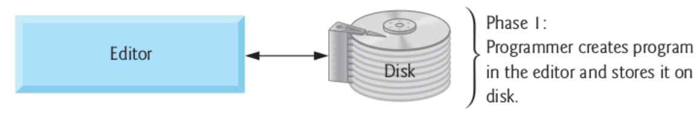
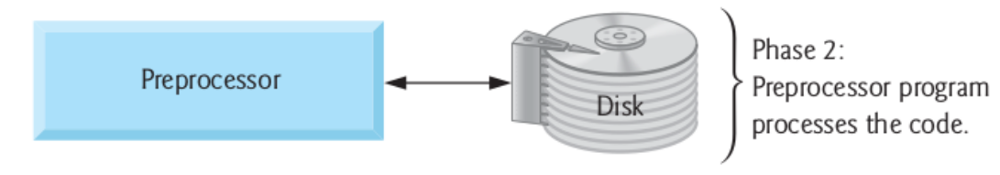
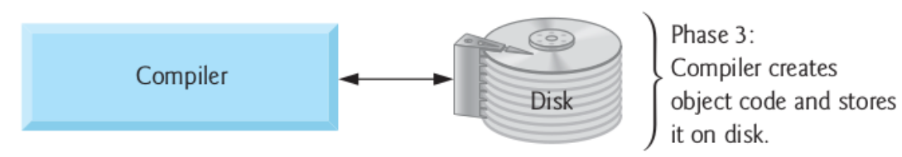
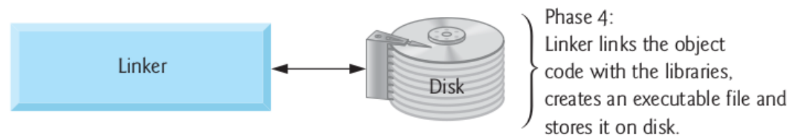
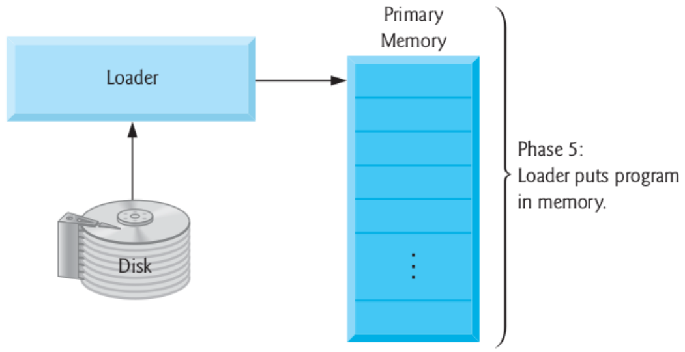
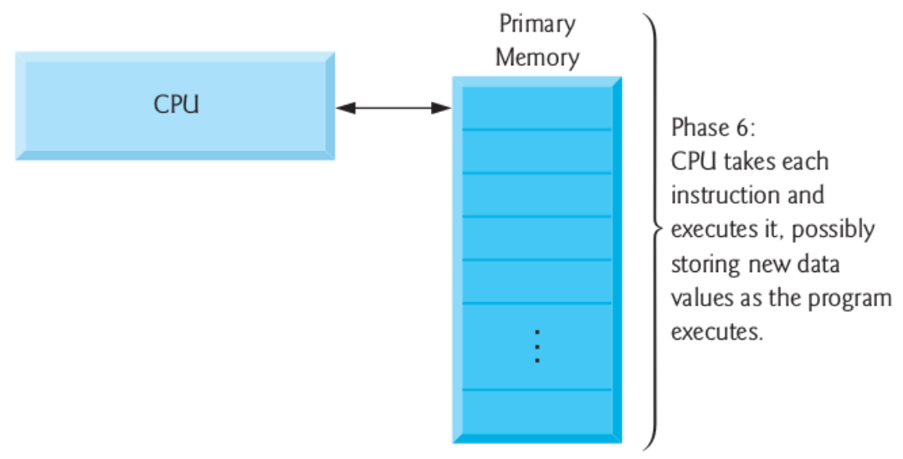

# Ambiente de Desenvolvimento

- Agora que sabemos o básico da sintaxe da linguagem C, como escrever programas e criar os executáveis a partir deles ? 
- Nesta aula examinaremos o `ambiente de desenvolvimento` C.
- Entenderemos melhor como os programas são **construı́dos** e transformados nos respectivos **binários**.
- Também exploraremos como fazer isso em diferentes plataformas: `GNU/Linux` e `WEB`.

## Ambiente
- O ambiente de desenvolvimento C consiste de vários componentes.
    - A linguagem.
    - O `ambiente de desenvolvimento` de programas.
    - A `biblioteca` padrão.
- Geralmente a criação de sistemas em C passam por **6 etapas**.

### Etapa 1: Criação do Programa
- Através de um `editor de texto` ou de uma `IDE`, o programador escreve o programa em C.
- Após salvar o `código-fonte`, ele é armazenado através de um arquivo no **disco rı́gido**.
- *Exemplos:* Code::Blocks, Sublime, Atom, Clion, Vim, Emacs, nano, gedit, geany, Eclipse, Visual Code, ...

### Etapa 2: Pré-Processamento
- Ao invocar o compilador, a primeira coisa que é feita é a **invocação** do `pré-processador` C.
- O `pré-processador` é responsável pela **manipulação** do programa antes da compilação propriamente dita.
- As diretivas de pré-processamento especificam que manipulações devem ser realizadas.
- As manipulações geralmente consistem de: **inclusão** de outros arquivos e **substituição** de textos.

### Etapa 3: Compilação
- A compilação **transforma** o programa manipulado pelo pré-processador em `linguagem de máquina`.

### Etapa 4: Ligação
- Os programas em C contém **referências** para as funções definidas em outros arquivos, como nas `bibliotecas padrões` ou `bibliotecas do programador`.
- O `código objeto` produzido pelo **compilador** possui então “buracos”.
- O ligador liga o código objeto do **código compilado** com o código objeto das **funções definidas** em outros lugares.
- Após a ligação temos o **executável**.

### Etapa 5: Carregamento
- O carregador (loader) **insere** o programa em `memória`.
- **Transfere-se** a imagem do executável do `disco` para a `memória`.
- Componentes adicionais de **bibliotecas dinâmicas** (shared) são carregadas nesta etapa.

### Etapa 6: Execução
- Após o carregamento, o programa pode ser executado.

