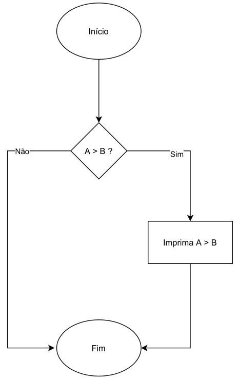

# Estrutura de Decisão
- As operações aritméticas também são consideradas **expressões**.
- Outro tipo de expressão, são as `expressões relacionais`, as quais possuem dois tipos de retorno:
    - `0 (Falso)`.
    - `1 (Verdadeiro)`.
- Podemos usar os **operadores relacionais** para realizar comparações entre duas expressões.
- O resultado destas comparações pode ser utilizado, através de **estruturas condicionais** para desviar o `fluxo do código`, fazendo com que ele se comporte de uma determinada maneira caso uma **condição especı́fica** seja atingida.



- Para escrever expressões mais complexas, podemos utilizar os **operadores lógicos**, que são capazes de `ligar` duas ou mais expressões de acordo com uma determinada finalidade:
    - **NÃO** `expr`.
    - `expr` **E** `expr`.
    - `expr` **OU** `expr`.
- As expressões criadas com estes operadores também podem ser utilizadas com finalidade de **desvio do fluxo do código**, fazendo com que ele se comporte de uma determinada forma quando certas condições forem atingidas.

## Operadores Relacionais

### Igualdade 
- O operador de igualdade, quando aplicado sobre duas expressões, `retorna 1` (**verdadeiro**), quando elas são iguais, ou `0` (**falso**), quando elas são diferentes.
- Na linguagem C, usamos os sı́mbolos `==`:
    - `9 == 9 // retorna 1 (verdadeiro)`.
    - `0 == 5 // retorna 0 (falso)`.

*Exemplos:* Igualdade
```c
#include <stdio.h>

int main(void) {
    printf("%d\n", 42 == 42); // retorna 1
    return 0;
}
```

```c
#include <stdio.h>

int main(void) {
    printf("%d\n", 21 == 42); // retorna 0
    return 0;
}
```

```c
#include <stdio.h>

int main(void) {
    printf("%d\n", (2 + 3) == (1 + 4)); // retorna 1
    return 0;
}
```

```c
#include <stdio.h>

int main(void) {
    int a = 2, b = 3, c = 1, d = 4; 
    printf("%d\n", (a + c) == (b + d)); // retorna 0
    return 0;
}
```

> [!WARNING]
>
> Não confundir os sı́mbolos de **atribuição** (`=`) e **igualdade** (`==`). 
> - `=` é utilizado para **atribuir** a uma variável o **valor** de uma expressão.
> - `==` é utilizado para **comparar** duas expressões.

### Diferença
- O operador de diferença, quando aplicado sobre duas expressões, `retorna 1` (**verdadeiro**), quando elas são diferentes, ou `0` (**falso**), quando elas são iguais.
- Na linguagem C, usamos os sı́mbolos `!=`:
    - `9 != 9 // retorna 0 (falso)`.
    - `0 != 5 // retorna 1 (verdadeiro)`.

*Exemplos:* Diferença
```c
#include <stdio.h>

int main(void) {
    printf("%d\n", 42 != 42); // retorna 0
    return 0;
}
```

```c
#include <stdio.h>

int main(void) {
    printf("%d\n", 21 != 42); // retorna 1
    return 0;
}
```

```c
#include <stdio.h>

int main(void) {
    printf("%d\n", (2 + 3) != (1 + 4)); // retorna 0
    return 0;
}
```

```c
#include <stdio.h>

int main(void) {
    int a = 2, b = 3, c = 1, d = 4; 
    printf("%d\n", (a + c) != (b + d)); // retorna 1
    return 0;
}
```

### Maior
- O operador maior, quando aplicado sobre duas expressões, `retorna 1` (**verdadeiro**), quando a da **esquerda é maior** que a da **segunda**, ou `0` (**falso**), caso contrário.
- Na linguagem C, usamos o sı́mbolo `>`:
    - `9 > 9 // retorna 0 (falso)`.
    - `5 > 0 // retorna 1 (verdadeiro)`.

### Maior ou Igual
- O operador maior ou igual, quando aplicado sobre duas expressões,
`retorna 1` (**verdadeiro**), quando a da **esquerda é maior ou igual** que a da **direita**, ou `0` (**falso**), caso contrário.
- Na linguagem C, usamos o sı́mbolo `>=`:
    - `9 >= 9 // retorna 1 (verdadeiro)`.
    - `0 >= 5 // retorna 0 (falso)`.

### Menor
- O operador menor, quando aplicado sobre duas expressões, `retorna 1` (**verdadeiro**), quando a da **esquerda é menor que** a da **direita**, ou `0` (**falso**), caso contrário.
- Na linguagem C, usamos o sı́mbolo `<`:
    - `9 < 9 // retorna 0 (falso)`.
    - `0 < 5 // retorna 1 (verdadeiro)`.

### Menor ou Igual
- O operador menor ou Igual, quando aplicado sobre duas expressões, `retorna 1` (**verdadeiro**), quando a da **esquerda é menor ou igual** que a da **direita**, ou `0` (**falso**), caso contrário.
- Na linguagem C, usamos o sı́mbolo `<=`:
    - `9 <= 9 // retorna 1 (verdadeiro)`. 
    - `5 <= 0 // retorna 0 (falso)`.

### Comparação de Números Reais
- Os operadores relacionais apresentados podem ser utilizados para **números inteiros**, **caracteres** ou **reais**.
- Contudo, devido à natureza aproximada da **representação computacional** dos **números reais**, a comparação pode **não** dar o **valor esperado**, devido à **erros de precisão** ou **arrendondamento**. 

*Exemplo:* Comparação de Reais 
```c

```

## Operadores Lógicos

## Estrutura de Decisão

## Considerações

