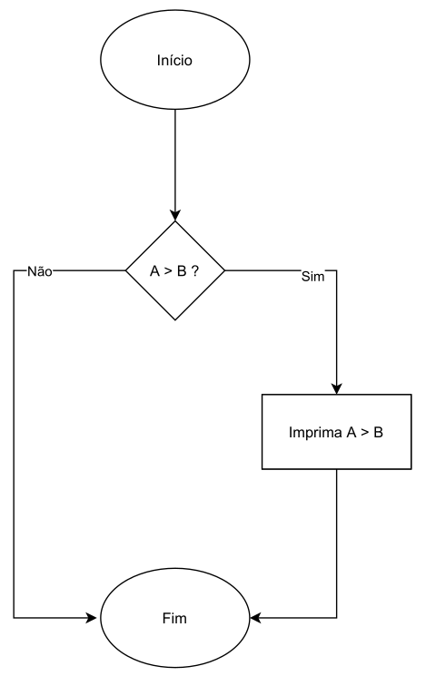

# Estrutura de Decisão
- As operações aritméticas também são consideradas **expressões**.
- Outro tipo de expressão, são as `expressões relacionais`, as quais possuem dois tipos de retorno:
    - `0 (Falso)`.
    - `1 (Verdadeiro)`.
- Podemos usar os **operadores relacionais** para realizar comparações entre duas expressões.
- O resultado destas comparações pode ser utilizado, através de **estruturas condicionais** para desviar o `fluxo do código`, fazendo com que ele se comporte de uma determinada maneira caso uma **condição especı́fica** seja atingida.


- Para escrever expressões mais complexas, podemos utilizar os **operadores lógicos**, que são capazes de `ligar` duas ou mais expressões de acordo com uma determinada finalidade:
    - **NÃO** `expr`.
    - `expr` **E** `expr`.
    - `expr` **OU** `expr`.
- As expressões criadas com estes operadores também podem ser utilizadas com finalidade de **desvio do fluxo do código**, fazendo com que ele se comporte de uma determinada forma quando certas condições forem atingidas.

## Operadores Relacionais

### Igualdade 
- O operador de igualdade, quando aplicado sobre duas expressões, `retorna 1` (**verdadeiro**), quando elas são iguais, ou `0` (**falso**), quando elas são diferentes.
- Na linguagem C, usamos os sı́mbolos `==`:
    - `9 == 9 // retorna 1 (verdadeiro)`.
    - `0 == 5 // retorna 0 (falso)`.

*Exemplos:* Igualdade
```c
#include <stdio.h>

int main(void) {
    printf("%d\n", 42 == 42); // retorna 1
    return 0;
}
```

```c
#include <stdio.h>

int main(void) {
    printf("%d\n", 21 == 42); // retorna 0
    return 0;
}
```

```c
#include <stdio.h>

int main(void) {
    printf("%d\n", (2 + 3) == (1 + 4)); // retorna 1
    return 0;
}
```

```c
#include <stdio.h>

int main(void) {
    int a = 2, b = 3, c = 1, d = 4; 
    printf("%d\n", (a + c) == (b + d)); // retorna 0
    return 0;
}
```

> [!WARNING]
>
> Não confundir os sı́mbolos de **atribuição** (`=`) e **igualdade** (`==`). 
> - `=` é utilizado para **atribuir** a uma variável o **valor** de uma expressão.
> - `==` é utilizado para **comparar** duas expressões.

### Diferença
- O operador de diferença, quando aplicado sobre duas expressões, `retorna 1` (**verdadeiro**), quando elas são diferentes, ou `0` (**falso**), quando elas são iguais.
- Na linguagem C, usamos os sı́mbolos `!=`:
    - `9 != 9 // retorna 0 (falso)`.
    - `0 != 5 // retorna 1 (verdadeiro)`.

*Exemplos:* Diferença
```c
#include <stdio.h>

int main(void) {
    printf("%d\n", 42 != 42); // retorna 0
    return 0;
}
```

```c
#include <stdio.h>

int main(void) {
    printf("%d\n", 21 != 42); // retorna 1
    return 0;
}
```

```c
#include <stdio.h>

int main(void) {
    printf("%d\n", (2 + 3) != (1 + 4)); // retorna 0
    return 0;
}
```

```c
#include <stdio.h>

int main(void) {
    int a = 2, b = 3, c = 1, d = 4; 
    printf("%d\n", (a + c) != (b + d)); // retorna 1
    return 0;
}
```

### Maior
- O operador maior, quando aplicado sobre duas expressões, `retorna 1` (**verdadeiro**), quando a da **esquerda é maior** que a da **segunda**, ou `0` (**falso**), caso contrário.
- Na linguagem C, usamos o sı́mbolo `>`:
    - `9 > 9 // retorna 0 (falso)`.
    - `5 > 0 // retorna 1 (verdadeiro)`.

### Maior ou Igual
- O operador maior ou igual, quando aplicado sobre duas expressões,
`retorna 1` (**verdadeiro**), quando a da **esquerda é maior ou igual** que a da **direita**, ou `0` (**falso**), caso contrário.
- Na linguagem C, usamos o sı́mbolo `>=`:
    - `9 >= 9 // retorna 1 (verdadeiro)`.
    - `0 >= 5 // retorna 0 (falso)`.

### Menor
- O operador menor, quando aplicado sobre duas expressões, `retorna 1` (**verdadeiro**), quando a da **esquerda é menor que** a da **direita**, ou `0` (**falso**), caso contrário.
- Na linguagem C, usamos o sı́mbolo `<`:
    - `9 < 9 // retorna 0 (falso)`.
    - `0 < 5 // retorna 1 (verdadeiro)`.

### Menor ou Igual
- O operador menor ou Igual, quando aplicado sobre duas expressões, `retorna 1` (**verdadeiro**), quando a da **esquerda é menor ou igual** que a da **direita**, ou `0` (**falso**), caso contrário.
- Na linguagem C, usamos o sı́mbolo `<=`:
    - `9 <= 9 // retorna 1 (verdadeiro)`. 
    - `5 <= 0 // retorna 0 (falso)`.

### Comparação de Números Reais
- Os operadores relacionais apresentados podem ser utilizados para **números inteiros**, **caracteres** ou **reais**.
- Contudo, devido à natureza aproximada da **representação computacional** dos **números reais**, a comparação pode **não** dar o **valor esperado**, devido à **erros de precisão** ou **arrendondamento**. 

*Exemplo:* Comparação de Reais 
```c
#include <stdio.h>

int main(void) {
    double a = 1.0;
    double b = (0.3 * 3) + 0.1;
    int valor_expr = (a == b);
    printf("%.20f %.20f %d\n", a, b, valor_expr); 
   // Resultado: 1.00000000000000000000 0.99999999999999988898 0
    return 0;
}
```

- O operador `==` **não** nos dá o **resultado esperado**, devido à natureza da representação em `ponto flutuante`.
- Uma possı́vel solução é usar um valor $\epsilon$ bastante pequeno de forma que, se |a − b| < $\epsilon$.
- O valor de ϵ deve ser **escolhido** de acordo com a sua aplicação.
- Usamos o comando `fabs(expr)` do cabeçalho `<math.h>` para obter o **valor absoluto** da expressão `expr`.

*Exemplo:* Comparação de Reais
```c
#include <stdio.h>
#include <math.h>

int main(void) {
    double a = 1.0;
    double b = (0.3 * 3) + 0.1;
    const double epsilon = 1e-6; // 0.000001, 10^-6
    int valor_expr = (fabs(a - b) < epsilon);
    printf("%.20f %.20f %d\n", a, b, valor_expr); 
    // Resultado: 1.00000000000000000000 0.99999999999999988898 1 
    return 0;
}
```

## Operadores Lógicos
- Os operadores lógicos conseguem ser aplicados em uma, duas ou mais expressões, para expressar uma **ideia mais complexa** a ser avaliada.
- Operadores:
    - **NÃO** (`!`).
    - **E** (`&&`).
    - **OU** (`||`).

### NÃO
- O operador lógico de **negação** (`NÃO`), quando aplicado a uma expressão:
    - `Retorna verdadeiro` quando a expressão é **falsa**.
    - `Retorna falso` quando a expressão é **verdadeira**.
- Utilizamos o sı́mbolo `!` para denotar o **operador de negação**.

| expr | !expr |
| :--: | :---: |
|  0   |   1   |
|  1   |   0   |

*Exemplo:* Verificação de um Número Ímpar
```c
#include <stdio.h>

int main(void) {
    int n;
    scanf("%d", &n);
    int impar = !((n % 2) == 0);
    printf("%d\n", impar);
    return 0;
}
```

### E
- O operador lógico de **conjunção** (`E`), quando aplicado a duas expressões:    
    - `Retorna verdadeiro` quando **ambas** as expressões são **verdadeiras**.
    - `Retorna falso` quando **pelo menos uma** das expressões é **falsa**.
- Utilizamos os sı́mbolos `&&` para denotar o operador de conjunção.

| expr1 | expr2 | expr1 && expr2 |
| :--:  | :----: | :-----------: |
|  0    |   0    |       0       |
|  0    |   1    |       0       |
|  1    |   0    |       0       |
|  1    |   1    |       1       |

*Exemplo:* Verificação de Número Divisível por 6
```c
#include <stdio.h>

int main(void) {
    int numero;
    scanf("%d", &numero);
    int divisivel_por_6 = (numero % 2 == 0)  && (numero % 3 == 0); 
    printf("%d\n", divisivel_por_6);
    return 0;
}
```

### OU
- O operador lógico de **conjunção** (`OU`), quando aplicado a duas expressões:
    - `Retorna verdadeiro` quando **ao menos uma** das expressões é **verdadeira**.
    - `Retorna falso` quando **ambas** as expressões são **falsas**.
- Utilizamos os sı́mbolos `||` para denotar o operador de disjunção.

| expr1 | expr2 | expr1 \|\| expr2 |
| :--:  | :----: | :-----------: |
|  0    |   0    |       0       |
|  0    |   1    |       1       |
|  1    |   0    |       1       |
|  1    |   1    |       1       |

*Exemplo:* Verificação de um Número Divisı́vel por 5 ou por 10
```c
#include <stdio.h>

int main() {
    int numero;
    scanf("%d", &numero);
    int divisivel_por_5_ou_10 = (numero % 5 == 0) || (numero % 10 == 0);
    printf("%d\n", divisivel_por_5_ou_10);
    return 0;
}
```

### Associatividade
- É possı́vel compor expressões com **vários operadores lógicos**.
- Neste caso, **nenhum** operador possui **precedência** sobre o outro.
- Contudo, a `associatividade` é da **esquerda para a direita**.
- Para verificar se (*um número é ı́mpar*) ou (*divisı́vel por 5 e 7 simultaneamente*), poderı́amos escrever a seguinte expressão: 

`!(n % 2 == 0) || ((n % 5 == 0) && (n % 7 == 0))`

- Os `parênteses` aqui são **indispensáveis**, pois sem eles, a expressão seria lida como: “(*o número é ı́mpar ou é divisı́vel por 5*) e *é divisı́vel por 7*”.
- Sem os parênteses, caso o número seja 41, temos que o número é **ı́mpar ou divisı́vel por 5**, mas **não é divisı́vel por 7**, portanto a expressão seria **falsa**.
- Com os parênteses, o número é ı́mpar, o que já configura a expressão **verdadeira**.

## Estrutura de Decisão
- As estruturas de decisão recebem uma expressão e, dependendo do **valor verdade** dela, é capaz de **desviar o código** para diferentes trechos.
- Podemos empregar as estruturas de decisão para que o programa se comporte de maneiras diferentes quando **determinadas condições** forem **atingidas**.

### Se Então
- A estrutura **Se, então** da linguagem C verifica o `valor da expressão` e (**Se**) e, caso ela seja `verdadeira`, **executa o bloco de código** relacionado à estrutura (**Então)**.
- Após finalizar a execução do bloco de código, o programa **continua a execução** de acordo com as instruções que estão abaixo do bloco de código.



#### Sintaxe
- Único Comando:
```c
if (expr)
    comando_1;
```

- Múltiplos Comandos:
```c
if (expr) {
    comando_1;
    comando_2;
    ...
    comando_n;
}
```

> [!NOTE]
>
> #### Observação: Uso das Chaves
> - É um erro de **lógica** não colocar chaves quando o bloco de comandos do **Se, Então** possui mais de um comando.
> - O código pode até `compilar`, mas o resultado **não** será o esperado.
> - Inclusive, as chaves podem ser utilizadas até quando se tem **apenas** um único comando no bloco.

#### Exemplos

*Exemplo:* Verifica se um Número é Maior que o Outro
```c
#include <stdio.h>

int main(void) {
    int a, b;
    printf("Digite dois valores, a e b: ");
    scanf("%d %d", &a, &b);
    if (a > b)
        printf("a = %d é maior que b = %d\n", a, b);
    return 0;
}
```

*Exemplo:* Verifica se um Número é Par
```c
#include <stdio.h>

int main(void) {
    int n;
    printf("Digite um número: ");
    scanf("%d", &n);
    if (n % 2 == 0)
        printf("%d é par\n", n);
    return 0;
}
```

*Exemplo:* Verifica se um Número é Múltiplo de 6
```c
#include <stdio.h>

int main(void) {
    int n;
    printf("Digite um número: ");
    scanf("%d", &n);
    if ((n % 2 == 0) && (n % 3 == 0))
        printf("%d é múltiplo de 6\n", n);
    return 0;
}
```

*Exemplo:* Verifica se um Número é Múltiplo de 2 ou de 5
```c
#include <stdio.h>

int main(void) {
    int n;
    printf("Digite um número: ");
    scanf("%d", &n);
    if (n % 2 == 0 || n % 5 == 0)
        printf("%d é múltiplo de 2 ou de 5\n", n);
    return 0;
}
```

*Exemplo:* Verifica se um Número é Par ou se Ele é Múltiplo de 5 e 7
```c
#include <stdio.h>

int main(void) {
    int n;
    printf("Digite um número: ");
    scanf("%d", &n);
    if (n % 2 == 0 || ((n % 5 == 0) && (n % 7 == 0)))
        printf("%d é par ou múltiplo de 5 e 7\n", n);
    return 0;
}
```

*Exemplo:* Troca o valor de Dois Números caso o Primeiro seja Maior que o Segundo
```c
#include <stdio.h>

int main(void) {
    int a, b;
    printf("Digite dois números: ");
    scanf("%d %d", &a, &b);
    if (a > b)
    {
        int aux = a;
        a = b;
        b = aux;
    }
    printf("%d %d\n", a, b);
    return 0;
}
```

> [!NOTE]
>
> #### Boa Prática de Programação: Indentação
> - Independente do bloco da estrutura if possuir um ou múltiplos comandos, estes devem estar **indentados** para maior **legibilidade** de código.

### Senão

*Exemplo:* 
```c

```

### Estruturas Aninhadas

### Operador Ternário

## Considerações

