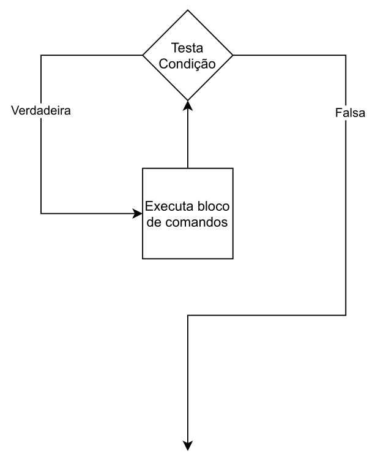
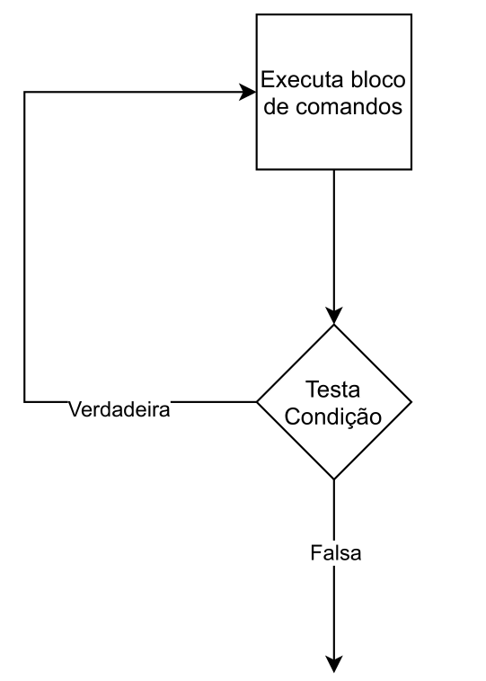
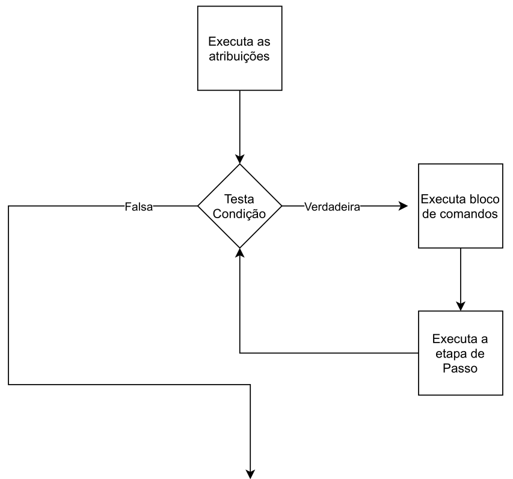

# Estruturas de Repetição

- As estruturas de repetição nos permitem **repetir** um determinado comando por um determinado número de vezes. 
- A linguagem C felizmente fornece para nós três estruturas de repetição: `while`, `do while` e `for`.

## While 

- `While` (**enquanto**): enquanto a **condição** for `verdadeira`, faça.
- A estrutura while segue o fluxo abaixo:
    1. Testa uma condição, caso ela seja verdadeira, vá para o passo 2, caso contrário, vá para o passo 4.
    2. Execute o bloco de comandos.
    3. Volte para o passo 1.
    4. Continue o fluxo normal de execução do programa.



#### Sintaxe
- Único Comando:
```c
while (comando)
    comando;
```

- Múltiplos Comandos:
```c
while (comando) {
    comando_1;
    comando_2;
    ...
    comando_n;
}
```

> [!NOTE]
>
> #### Observação: 
> - A condicao é uma **expressão** e pode envolver `operadores relacionais`, `aritméticos` e `lógicos`.

#### Exemplos
*Exemplo:* O usuário deve digitar um valor n e o programa deverá imprimir todos os inteiros positivos até o valor n.

```c
#include <stdio.h>

int main(void) {
    int n;
    printf("Dígite um número: ");
    scanf("%d", &n);
    int i = 1;
    while (i <= n) 
    {
        printf("%d\n", i);
        i++;
    }
    
    return 0;
}
```

## Do While

- A estrutura `do while` em C **primeiro** executa os comandos para depois verificar se a condição é verdadeira.
- Enquanto a condição for verdadeira, volta a executar o bloco de comandos.
- Garante que o bloco de comandos é executado **pelo menos uma vez**.
- `Do While`: faça enquanto a condição for verdadeira.
- A estrutura do while segue o fluxo abaixo:
    1. Execute o bloco de comandos.
    2. Verifique se a condição é verdadeira, em caso afirmativo, vá para o passo 1, caso contrário, vá para o passo 3.
    3. Continue o fluxo normal de execução do programa.



#### Sintaxe
- Único Comando:
```c
do 
    comando;
while (condicao);
```

- Múltiplos Comandos:
```c
do {
    comando_1;
    comando_2;
    ...
    comando_n;
} while (condicao);
```

> [!NOTE]
>
> #### Observação: 
> - A condicao é uma **expressão** e pode envolver `operadores relacionais`, `aritméticos` e `lógicos`.

#### Exemplos
*Exemplo:* O usuário deve digitar um valor n e o programa deverá imprimir todos os inteiros positivos até o valor n.

```c
#include <stdio.h>

int main(void) {
    int n;
    printf("Dígite um número: ");
    scanf("%d", &n);
    int i = 1;
    do
    {
        printf("%d\n", i);
        i++;    
    } while (i <= n);
   
    return 0;
}
```

### While x Do While
- Devemos empregar o while e o do while em situações adequadas.
- `while` : o teste da condição é feito **antes da execução** do bloco.
- `do while` : o teste da condição é feito apenas **após a execução** do bloco.
- Existem ocasiões em que o uso de um é mais **apropriado** que o uso do outro.
- Vamos examinar agora um problema cuja solução é mais **natural** com `do while` .

*Exemplo:* Enquanto o usuário não digitar o valor 0, deverá ser lido um inteiro.Finalmente, quando o usuário digitar o valor 0, o programa deverá parar de ler os valores, apresentar a soma de todos os números lidos e encerrar.

```c
#include <stdio.h>

int main()
{
    int num;
    int soma = 0;
    
    do
    {
        printf("Digite um número: ");
        scanf("%d", &num);
        soma += num;
    } while (num != 0);
    
    printf("Soma: %d\n", soma);

    return 0;
}
```

- O programa equivalente utilizando a estrutura `while` pode ser visto a seguir. 

```c
#include <stdio.h>

int main()
{
    int num;
    int soma = 0;
    
    printf("Digite um número: ");
    scanf("%d", &num);
    
    while (num != 0)
    {
        soma += num;
        printf("Digite um número: ");
        scanf("%d", &num);
    }

    printf("Soma: %d\n", soma);
    
    return 0;
}
```

## For

- A estrutura `for` em C tenta compactar um **padrão** muito comum observado em laços de repetição em C.
- Ele possui três mecanismos:
    - **Atribuição:** nesta etapa, todas as **atribuições preliminares** são feitas **antes** do laço propriamente dito. Estas atribuições **não** são executadas durante o laço, mas sim uma **única** vez.
    - **Condição**: Nesta etapa, a condição é verificada, se verdadeira, executa-se o bloco de comandos.
    - **Passo:** Os comandos descritos desta etapa só são executados caso o bloco de comandos seja **executado** da **etapa anterior** seja e sempre após ele.



- A estrutura `for` (**para**) segue o fluxo abaixo:
    1. Executa os comandos de atribuição.
    2. Verifica a condição se verdadeira, vá para o passo 3, se falsa, vá para o passo 6.
    3. Execute o bloco de comandos.
    4. Execute os comandos de passo.
    5. Vá para o passo 2.
    6. Continue o fluxo normal do programa 

#### Sintaxe
- Único Comando:
```c
for (atribuicoes; condicao; passo)
    comando;
```

- Múltiplos Comandos:
```c
for (atribuicoes; condicao; passo) {
    comando_1;
    comando_2;
    ...
    comando_n;
    }
```

> [!NOTE]
>
> #### Observação: 
> - Os comandos de atribuição e passos devem ser separados por ponto e vı́rgulas. 
> - A condicao é uma **expressão** e pode envolver `operadores relacionais`, `aritméticos` e `lógicos`.

#### Exemplos
*Exemplo:* O usuário deve digitar um valor n e o programa deverá imprimir todos os inteiros positivos até o valor n.

```c
#include <stdio.h>

int main()
{
    int n;
    printf("Dígite um número: ");
    scanf("%d", &n);
    int i;
    for (i = 1; i <= n; i++)
    {
        printf("%d\n", i);
    }
    
    return 0;
}
```

*Exemplo:* Agora, considere o problema de imprimir todos os pares de números inteiros positivos cuja soma é 100.

```c
#include <stdio.h>

int main()
{
    int i,j;
    for (i = 1,j = 99; i <= j; i++, j--)
    {
        printf("%d + %d = 100\n", i,j);
    }
    
    return 0;
}
```

### For x While

- É fácil ver que a estrutura `for` segue uma estrutura muito **parecida** a do `while` , mas de forma um pouco mais **compacta**.
- É possı́vel escrever um código equivalente usando while da seguinte forma:

```c
atribuicao_1;
atribuicao_2;
...
atribuicao_m;
while (condicao) {
    comando_1;
    comando_2;
    ...
    comando_n;
    passo_1;
    passo_2;
    ...
    passo_l;
}
```

> [!NOTE]
>
> -  Se não houver necessidade de executar **comandos de atribuição** ou **passo**, talvez seja mais interessante utilizar o `while` , por **questões de legibilidade**.

## Considerações

> [!WARNING]
>
> - Assim como as estruturas condicionais, é importante manter a **indentação** correta nas estruturas de repetição.
> - A cada novo bloco de código, adicione um **caractere de tabulação extra** em relação ao bloco anterior.
